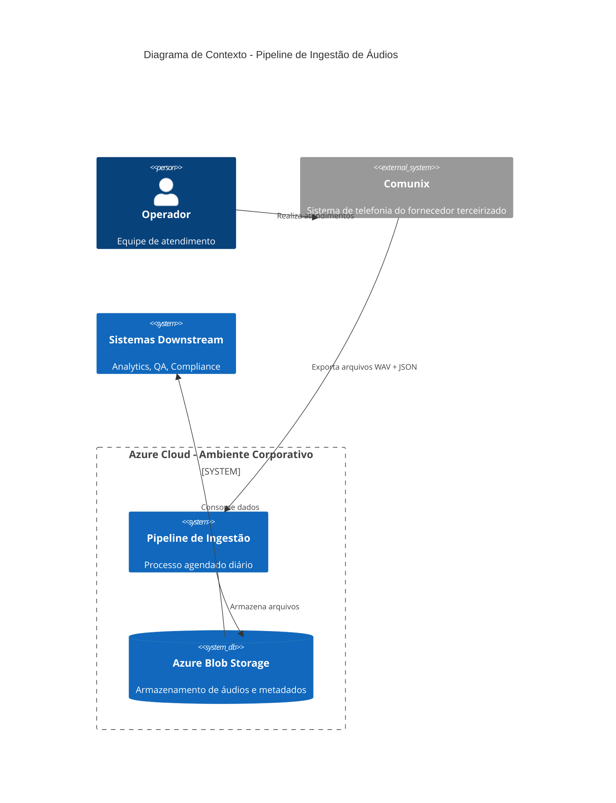
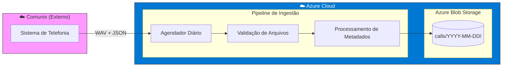
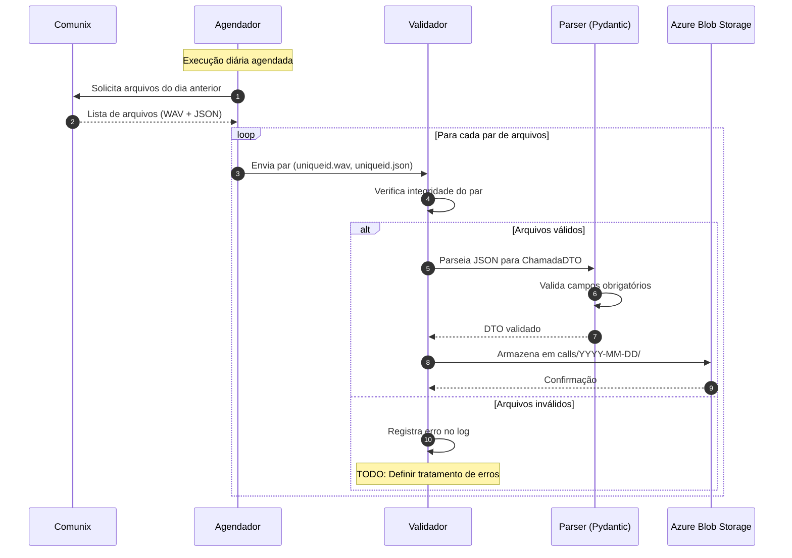

# Pipelines de Ingestão de Dados

> **Versão:** 0.1.0  
> **Última atualização:** 2026-02-12  
> **Status:** Em desenvolvimento

---

## Índice

1. [Visão Geral](#visão-geral)
2. [Arquitetura](#arquitetura)
3. [Estrutura de Armazenamento](#estrutura-de-armazenamento)
4. [Especificação de Metadados](#especificação-de-metadados)
5. [Modelo de Dados (DTO)](#modelo-de-dados-dto)
6. [Regras de Negócio](#regras-de-negócio)
7. [Glossário](#glossário)
8. [Requisitos Não Funcionais](#requisitos-não-funcionais)
9. [Changelog](#changelog)
10. [📚 Documentação](#-documentação)

---

## 📚 Documentação

### Guias de Colaboração

| Documento | Descrição |
|-----------|-----------|
| [CONTRIBUTING](docs/CONTRIBUTING.md) | Guia completo de contribuição |
| [CODE_OF_CONDUCT](docs/CODE_OF_CONDUCT.md) | Código de conduta |
| [SECURITY](docs/SECURITY.md) | Política de segurança |

### Padrões e Convenções

| Documento | Descrição |
|-----------|-----------|
| [Conventional Commits](docs/CONVENTIONAL_COMMITS.md) | Padrão de mensagens de commit |
| [Semantic Versioning](docs/SEMANTIC_VERSIONING.md) | Versionamento semântico |
| [Branching Strategy](docs/BRANCHING_STRATEGY.md) | Estratégia de branches |
| [Pull Request Guide](docs/PULL_REQUEST_GUIDE.md) | Guia de Pull Requests |

### Configuração

| Documento | Descrição |
|-----------|-----------|
| [Repository Setup](docs/REPOSITORY_SETUP.md) | Configuração do repositório |

---

## Visão Geral

Este projeto implementa um pipeline de ingestão de dados. Esta versão incical contempla o escopo dos arquivos de áudio de chamadas telefônicas provenientes do sistema **Comunix** (fornecedor terceirizado) e respectivos metadados.  
O processo é executado diariamente de forma agendada e armazena os arquivos no ambiente Azure da Sabesp.
Motivação: criação de projeto escalável e flexível, baseado em melhores práticas da indústria e dolorosas lições aprendidas nos últimos meses.

### Objetivos

- [ ] *TODO: Definir objetivos de negócio com stakeholders*
- [ ] *TODO: Definir escopo inicial com stakeholders* (`raw` já em discussão)
- [ ] *TODO: Mapear e documentar outras fontes externas e internas*
- [ ] *TODO: Comunicar todo o time, incentivar e habilitar colaboração*
- [ ] *TODO: Definir estratégias e regras para colaboração*
- [ ] *TODO: Definir casos de uso dos dados ingeridos (analytics, compliance, QA, etc.)*

### Stakeholders

| Papel | Nome | Contato |
|-------|------|---------|
| Product Owner | *TODO* | *TODO* |
| Tech Lead | *TODO* | *TODO* |
| Arquiteto | *TODO* | *TODO* |
| Comunix (Vendor) | *TODO* | *TODO* |
| Relatórios CSV (Interno?) | *TODO* | *TODO* |
| *TODO* | *TODO* | *TODO* |
---

## Arquitetura

### Diagrama de Contexto



### Fluxo de Ingestão



### Fluxo Detalhado



### Decisões de Arquitetura

| ID | Decisão | Status | Data |
|----|---------|--------|------|
| ADR-001 | *TODO: Tecnologia do agendador (Azure Functions, Data Factory, etc.)* | Pendente | - |
| ADR-002 | *TODO: Estratégia de retry em caso de falha* | Pendente | - |
| ADR-003 | *TODO: Política de retenção de arquivos* | Pendente | - |

---

## Estrutura de Armazenamento

Os arquivos são armazenados no Azure Blob Storage seguindo a estrutura abaixo:

```
calls/
├── 2026-01-01/
│   ├── 001234567890.json
│   ├── 001234567890.wav
│   ├── 001234567765.json
│   └── 001234567765.wav
├── 2026-01-02/
│   ├── 001234568001.json
│   ├── 001234568001.wav
│   └── ...
└── 2026-02-11/
    ├── 00177079922815.json
    ├── 00177079922815.wav
    └── ...
```

### Convenção de Nomenclatura

| Componente | Formato | Exemplo |
|------------|---------|---------|
| Container | `calls` | `calls` |
| Pasta | `YYYY-MM-DD` (data da chamada) | `2026-02-11` |
| Arquivo de áudio | `{uniqueid_sanitizado}.wav` | `00177079922815.wav` |
| Arquivo de metadados | `{uniqueid_sanitizado}.json` | `00177079922815.json` |

> **Nota:** O `uniqueid` é sanitizado removendo pontos (`.`) do valor original.  (*TODO* validar)
> Exemplo: `001770799228.15` → `00177079922815`

### Configurações de Storage

| Parâmetro | Valor | Observação |
|-----------|-------|------------|
| Storage Account | *TODO* | - |
| Container | `calls` | - |
| Tier | *TODO: Hot/Cool/Archive* | Definir com base no padrão de acesso |
| Redundância | *TODO: LRS/ZRS/GRS* | - |
| Política de Retenção | *TODO* | Definir requisitos de compliance |

---

## Especificação de Metadados

Cada arquivo de áudio `.wav` possui um arquivo `.json` correspondente com os metadados da chamada.

### Exemplo de Arquivo JSON

```json
{
  "uniqueid": "001770799228.15",
  "uniqueid_bilhetador": "001770799228.15",
  "nu_telefone": "11999999999",
  "dt_inicio": "2026-02-11 05:40:48",
  "dt_fim": "2026-02-11 05:55:39",
  "hr_duracao_atendimento": "891",
  "hr_duracao_fila": "1",
  "tp_chamada": "1",
  "cd_ramal": "5747",
  "cd_servico": "532",
  "nm_servico": "Falar com atendente",
  "ds_desligamento": "C",
  "ds_cti": "2602110009813063_525468617001_0_0_0_410396",
  "ds_tipo_chamada": "atendida",
  "cd_agente": "410396",
  "nm_agente": "João Silva",
  "cd_equipe": "139",
  "nm_equipe": "Equipe Atendimento SP",
  "dt_chamada": "2026-02-11",
  "timestamp": 1770799248,
  "hr_duracao_ura_bot": "14",
  "hr_duracao": 906
}
```

### Descrição dos Campos

| Campo | Tipo | Descrição | Obrigatório |
|-------|------|-----------|-------------|
| `uniqueid` | string | Identificador único da chamada no sistema | Sim |
| `uniqueid_bilhetador` | string | Identificador único da chamada no bilhetador (sistema de tarifação) | Sim |
| `nu_telefone` | string | Número de telefone do cliente (com DDD) | Sim |
| `dt_inicio` | datetime | Data e hora de início da chamada | Sim |
| `dt_fim` | datetime | Data e hora de término da chamada | Sim |
| `hr_duracao_atendimento` | int | Duração do atendimento em segundos | Sim |
| `hr_duracao_fila` | int | Tempo de espera na fila em segundos | Sim |
| `tp_chamada` | string | Tipo da chamada (código numérico) | Sim |
| `cd_ramal` | string | Código do ramal utilizado no atendimento | Sim |
| `cd_servico` | string | Código do serviço solicitado | Sim |
| `nm_servico` | string | Nome/descrição do serviço solicitado | Sim |
| `ds_desligamento` | string | Tipo de desligamento: `C`=Cliente, `A`=Agente, `T`=Timeout | Sim |
| `ds_cti` | string | Identificador CTI (Computer Telephony Integration) | Sim |
| `ds_tipo_chamada` | string | Status final: `atendida`, `abandonada`, `transferida` | Sim |
| `cd_agente` | string | Código identificador do agente de atendimento | Sim |
| `nm_agente` | string | Nome completo do agente de atendimento | Sim |
| `cd_equipe` | string | Código da equipe do agente | Sim |
| `nm_equipe` | string | Nome da equipe do agente | Sim |
| `dt_chamada` | date | Data da chamada (somente data, sem hora) | Sim |
| `timestamp` | int | Timestamp Unix do registro da chamada | Sim |
| `hr_duracao_ura_bot` | int | Duração da interação com URA/Bot em segundos | Sim |
| `hr_duracao` | int | Duração total da chamada em segundos | Sim |

### Convenção de Prefixos

| Prefixo | Significado | Exemplo |
|---------|-------------|---------|
| `nm_` | Nome | `nm_agente` = Nome do agente |
| `ds_` | Descrição | `ds_desligamento` = Descrição do desligamento |
| `cd_` | Código | `cd_ramal` = Código do ramal |
| `tp_` | Tipo | `tp_chamada` = Tipo da chamada |
| `nu_` | Número | `nu_telefone` = Número de telefone |
| `dt_` | Data | `dt_inicio` = Data de início |
| `hr_` | Hora/Duração | `hr_duracao` = Duração em segundos |

---

## Modelo de Dados (DTO)

### ChamadaDTO (Pydantic)

```python
from datetime import datetime, date
from typing import Literal, Optional
from pydantic import BaseModel, Field, field_validator


class ChamadaDTO(BaseModel):
    """
    DTO para representação de dados de uma chamada telefônica.
    Contém informações sobre atendimento, duração, agente e serviço.
    """

    uniqueid: str = Field(
        ...,
        description="Identificador único da chamada no sistema",
        examples=["001770799228.15"]
    )

    uniqueid_bilhetador: str = Field(
        ...,
        description="Identificador único da chamada no bilhetador (sistema de tarifação)",
        examples=["001770799228.15"]
    )

    nu_telefone: str = Field(
        ...,
        min_length=10,
        max_length=15,
        description="Número de telefone do cliente (com DDD)",
        examples=["11999999999"]
    )

    dt_inicio: datetime = Field(
        ...,
        description="Data e hora de início da chamada",
        examples=["2026-02-11 05:40:48"]
    )

    dt_fim: datetime = Field(
        ...,
        description="Data e hora de término da chamada",
        examples=["2026-02-11 05:55:39"]
    )

    hr_duracao_atendimento: int = Field(
        ...,
        ge=0,
        description="Duração do atendimento em segundos",
        examples=[891]
    )

    hr_duracao_fila: int = Field(
        ...,
        ge=0,
        description="Tempo de espera na fila em segundos",
        examples=[1]
    )

    tp_chamada: str = Field(
        ...,
        description="Tipo da chamada (código numérico)",
        examples=["1"]
    )

    cd_ramal: str = Field(
        ...,
        description="Código do ramal utilizado no atendimento",
        examples=["5747"]
    )

    cd_servico: str = Field(
        ...,
        description="Código do serviço solicitado",
        examples=["532"]
    )

    nm_servico: str = Field(
        ...,
        min_length=1,
        max_length=255,
        description="Nome/descrição do serviço solicitado",
        examples=["Falar com atendente"]
    )

    ds_desligamento: Literal["C", "A", "T"] = Field(
        ...,
        description="Descrição do tipo de desligamento: C=Cliente, A=Agente, T=Timeout",
        examples=["C"]
    )

    ds_cti: str = Field(
        ...,
        description="Descrição/identificador CTI (Computer Telephony Integration)",
        examples=["2602110009813063_525468617001_0_0_0_410396"]
    )

    ds_tipo_chamada: Literal["atendida", "abandonada", "transferida"] = Field(
        ...,
        description="Descrição do status final da chamada",
        examples=["atendida"]
    )

    cd_agente: str = Field(
        ...,
        description="Código identificador do agente de atendimento",
        examples=["410396"]
    )

    nm_agente: str = Field(
        ..., 
        min_length=1,
        max_length=255,
        description="Nome completo do agente de atendimento",
        examples=["João Silva"]
    )

    cd_equipe: str = Field(
        ...,
        description="Código da equipe do agente",
        examples=["139"]
    )

    nm_equipe: str = Field(
        ..., 
        min_length=1,
        max_length=255,
        description="Nome da equipe do agente",
        examples=["Equipe Atendimento SP"]
    )

    dt_chamada: date = Field(
        ...,
        description="Data da chamada (somente data, sem hora)",
        examples=["2026-02-11"]
    )

    timestamp: int = Field(
        ...,
        gt=0,
        description="Timestamp Unix do registro da chamada",
        examples=[1770799248]
    )

    hr_duracao_ura_bot: int = Field(
        ...,
        ge=0,
        description="Duração da interação com URA/Bot em segundos",
        examples=[14]
    )

    hr_duracao: int = Field(
        ...,
        ge=0,
        description="Duração total da chamada em segundos",
        examples=[906]
    )

    @field_validator("nu_telefone")
    @classmethod
    def validar_telefone(cls, v: str) -> str:
        """Valida se o número de telefone contém apenas dígitos."""
        if not v.isdigit():
            raise ValueError("Número de telefone deve conter apenas dígitos")
        return v

    @field_validator("dt_fim")
    @classmethod
    def validar_fim_apos_inicio(cls, v: datetime, info) -> datetime:
        """Valida se a data de término é posterior à data de início."""
        if "dt_inicio" in info.data and v < info.data["dt_inicio"]:
            raise ValueError("Data de término deve ser posterior à data de início")
        return v

    @field_validator("hr_duracao")
    @classmethod
    def validar_duracao_total(cls, v: int, info) -> int:
        """Valida se a duração total é consistente com atendimento + fila + URA."""
        data = info.data
        if all(k in data for k in ["hr_duracao_atendimento", "hr_duracao_fila", "hr_duracao_ura_bot"]):
            soma = data["hr_duracao_atendimento"] + data["hr_duracao_fila"] + data["hr_duracao_ura_bot"]
            if v < soma:
                raise ValueError(
                    f"Duração total ({v}s) não pode ser menor que a soma dos componentes ({soma}s)"
                )
        return v

    class Config:
        json_schema_extra = {
            "example": {
                "uniqueid": "001770799228.15",
                "uniqueid_bilhetador": "001770799228.15",
                "nu_telefone": "11999999999",
                "dt_inicio": "2026-02-11T05:40:48",
                "dt_fim": "2026-02-11T05:55:39",
                "hr_duracao_atendimento": 891,
                "hr_duracao_fila": 1,
                "tp_chamada": "1",
                "cd_ramal": "5747",
                "cd_servico": "532",
                "nm_servico": "Falar com atendente",
                "ds_desligamento": "C",
                "ds_cti": "2602110009813063_525468617001_0_0_0_410396",
                "ds_tipo_chamada": "atendida",
                "cd_agente": "410396",
                "nm_agente": "João Silva",
                "cd_equipe": "139",
                "nm_equipe": "Equipe Atendimento SP",
                "dt_chamada": "2026-02-11",
                "timestamp": 1770799248,
                "hr_duracao_ura_bot": 14,
                "hr_duracao": 906
            }
        }
```

### Exemplo de Uso

```python
import json
from pathlib import Path

# Carregar arquivo JSON
json_path = Path("calls/2026-02-11/00177079922815.json")
with open(json_path) as f:
    data = json.load(f)

# Validar e criar DTO
try:
    chamada = ChamadaDTO(**data)
    print(f"Chamada {chamada.uniqueid} validada com sucesso!")
    print(f"Duração total: {chamada.hr_duracao} segundos")
    print(f"Agente: {chamada.nm_agente}")
except ValidationError as e:
    print(f"Erro de validação: {e}")
```

---

## Regras de Negócio

### Tipos de Desligamento (`ds_desligamento`)

| Código | Descrição | Observação |
|--------|-----------|------------|
| `C` | Cliente | O cliente encerrou a chamada |
| `A` | Agente | O agente encerrou a chamada |
| `T` | Timeout | A chamada foi encerrada por tempo limite |

### Tipos de Chamada (`tp_chamada`)

| Código | Descrição |
|--------|-----------|
| `1` | *TODO: Solicitar documentação ao Comunix* |
| *TODO* | *TODO* |

### Status da Chamada (`ds_tipo_chamada`)

| Status | Descrição |
|--------|-----------|
| `atendida` | Chamada foi atendida por um agente |
| `abandonada` | Cliente desistiu antes do atendimento |
| `transferida` | Chamada foi transferida para outro setor |

### Cálculo de Duração

```
hr_duracao (total) ≥ hr_duracao_ura_bot + hr_duracao_fila + hr_duracao_atendimento
```

> **Nota:** A duração total pode ser maior que a soma dos componentes devido a tempos de transição não contabilizados individualmente.

### Regras de Validação Pendentes

- [ ] *TODO: Definir valores válidos para `tp_chamada`*
- [ ] *TODO: Definir valores válidos para `cd_servico`*
- [ ] *TODO: Definir se campos podem ser nulos em cenários específicos (ex: chamada abandonada)*
- [ ] *TODO: Definir regras de negócio para chamadas transferidas*

---

## Glossário (Linguagem Ubíqua)

| Termo | Definição |
|-------|-----------|
| **Bilhetador** | Sistema responsável pela tarifação e registro de chamadas telefônicas |
| **CTI** | Computer Telephony Integration - Integração entre sistemas de telefonia e computadores |
| **URA** | Unidade de Resposta Audível - Sistema automatizado de atendimento por voz |
| **Bot** | Assistente virtual automatizado para atendimento inicial |
| **Ramal** | Extensão telefônica interna utilizada pelo agente |
| **Comunix** | Fornecedor terceirizado do sistema de telefonia |
| **Agente** | Atendente humano responsável pelo atendimento da chamada |
| **Equipe** | Grupo de agentes organizados por função ou localidade |

### Termos Técnicos

| Termo | Definição |
|-------|-----------|
| **Azure Blob Storage** | Serviço de armazenamento de objetos da Microsoft Azure |
| **DTO** | Data Transfer Object - Objeto para transferência de dados entre camadas |
| **Pipeline** | Sequência automatizada de processamento de dados |
| **Timestamp Unix** | Número de segundos desde 01/01/1970 00:00:00 UTC |

---

## Requisitos Não Funcionais

### Volumetria

| Métrica | Valor | Observação |
|---------|-------|------------|
| Chamadas/dia | *TODO* | Solicitar ao Comunix |
| Tamanho médio do WAV | *TODO* | Solicitar ao Comunix |
| Tamanho médio do JSON | ~1 KB | Estimado |
| Crescimento mensal | *TODO* | - |

### SLA

| Métrica | Valor | Observação |
|---------|-------|------------|
| Disponibilidade do pipeline | *TODO* | - |
| Tempo máximo de ingestão | *TODO* | - |
| Janela de execução | *TODO* | Horário do agendamento diário |

### Segurança

| Requisito | Status | Observação |
|-----------|--------|------------|
| Criptografia em trânsito | *TODO* | HTTPS/TLS |
| Criptografia em repouso | *TODO* | Azure Storage encryption |
| Controle de acesso | *TODO* | Azure RBAC |
| Auditoria de acesso | *TODO* | Azure Monitor |
| Dados sensíveis (LGPD) | *TODO* | `nu_telefone`, `nm_agente` são dados pessoais |

### Monitoramento

| Item | Ferramenta | Status |
|------|------------|--------|
| Logs de execução | *TODO* | - |
| Alertas de falha | *TODO* | - |
| Métricas de performance | *TODO* | - |
| Dashboard | *TODO* | - |

---

## Changelog

| Versão | Data | Autor | Descrição |
|--------|------|-------|-----------|
| 0.1.0 | 2026-02-12 | @mgonzalez | Versão inicial do documento |

---

## Pendências e Próximos Passos

- [ ] Validar especificação de metadados com Comunix
- [ ] Definir campos opcionais/obrigatórios com stakeholders
- [ ] Documentar todos os valores possíveis de `tp_chamada`
- [ ] Definir política de retenção de dados
- [ ] Avaliar requisitos de LGPD para dados sensíveis
- [ ] Definir estratégia de tratamento de erros
- [ ] Definir tecnologias para o agendador (Azure Functions, etc.)
- [ ] Definir tecnologias Object Storage, Databricks
- [ ] Definir ambiente de desenvolvimento
- [ ] Definir ambiente de homologação

---

> **Contato:** Para dúvidas sobre este documento, entre em contato com *TODO*.
