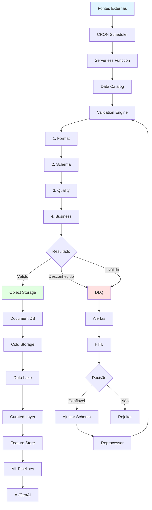
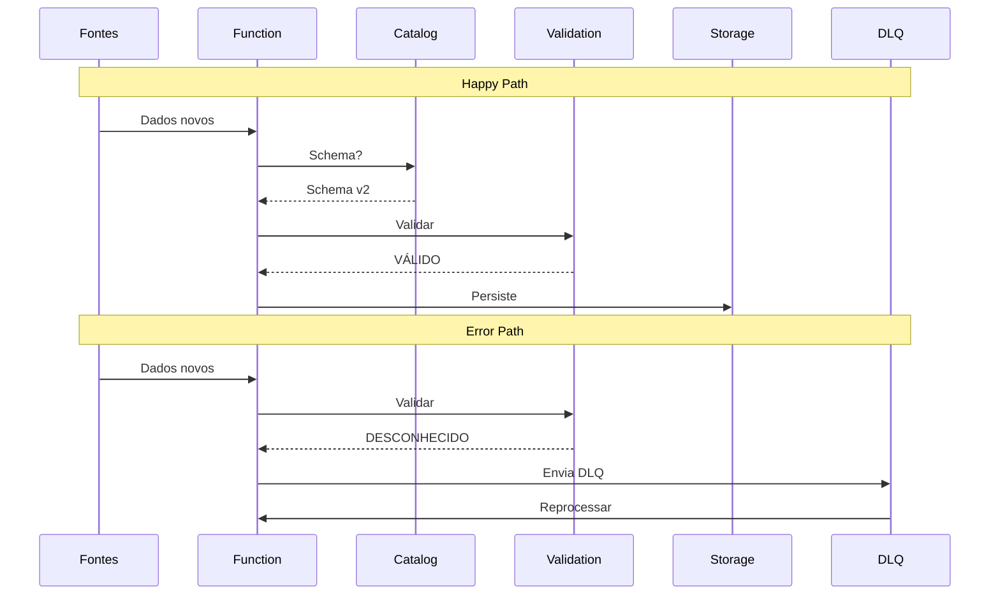

# Arquitetura — Pipeline de Ingestão de Dados

**Equipe:** Dados e Inteligência Artificial  
**Versão:** 0.2.0  
**Última Atualização:** 2026-02-14  
**Status:** Em desenvolvimento

---

## Índice

1. [Visão Geral](#visão-geral)
2. [Diagrama de Arquitetura ASCII](#diagrama-de-arquitetura-ascii)
3. [Diagramas Mermaid](#diagramas-mermaid)
4. [Justificativa Teórica](#justificativa-teórica)
5. [Análise de Riscos](#análise-de-riscos)
6. [Ciclo de Vida e Armazenamento a Frio](#ciclo-de-vida-e-armazenamento-a-frio)
7. [Comparação de Formatos](#comparação-de-formatos)
8. [Glossário](#glossário)
9. [Referências](#referências)

---

## Visão Geral

Pipeline de ingestão desenvolvido para capturar, validar e armazenar dados de fontes externas (Comunix, Relatórios, FTP) com escalabilidade, resiliência e conformidade LGPD/GDPR.

**Características principais:**
- Ingestão Serverless event-driven
- Validação 4 estágios (Format/Schema/Quality/Business)
- Storage tiered (Hot/Cool/Archive)
- DLQ com análise humana
- Observabilidade completa
- Governança integrada

Agnóstico de cloud (AWS/Azure/GCP). Formatos: JSON (raw), Parquet/Delta/Iceberg (curated).

---

## Diagrama de Arquitetura ASCII

```
                    FONTES EXTERNAS
    ╔═══════════════════════════════════════════════╗
    ║   Comunix     Relatórios     Servidores FTP   ║
    ╚═══════════════════════════════════════════════╝
                         │
                         ▼
              ┌──────────────────────┐
              │  CRON Scheduler      │
              │  (Scan diário 00:00) │
              └──────────────────────┘
                         │
                         ▼
              ┌──────────────────────┐
              │ Serverless Function  │
              │ (Event-driven)       │
              └──────────────────────┘
                         │
                         ▼
    ╔═══════════════════════════════════════════════╗
    ║        INGESTION & VALIDATION PIPELINE        ║
    ║                                               ║
    ║  ┌───────────────────────────────────────┐   ║
    ║  │      Data Catalog                     │   ║
    ║  │  ┌─────────────────┐ ┌──────────────┐│   ║
    ║  │  │ Schema Registry │ │Quality Rules ││   ║
    ║  │  └─────────────────┘ └──────────────┘│   ║
    ║  └───────────────────────────────────────┘   ║
    ║                    │                          ║
    ║                    ▼                          ║
    ║         ┌──────────────────────┐              ║
    ║         │  Validation Engine   │              ║
    ║         │ ┌──────────────────┐ │              ║
    ║         │ │ 1. Format Check  │ │              ║
    ║         │ │ 2. Schema Valid. │ │              ║
    ║         │ │ 3. Quality Rules │ │              ║
    ║         │ │ 4. Business Log. │ │              ║
    ║         │ └──────────────────┘ │              ║
    ║         └──────────────────────┘              ║
    ║                    │                          ║
    ╚════════════════════╪═══════════════════════════╝
                         │
         ┌───────────────┼───────────────┐
         │               │               │
         ▼               ▼               ▼
    ┌────────┐    ┌──────────┐    ┌────────────┐
    │ VÁLIDO │    │DESCONHEC.│    │  INVÁLIDO  │
    └────────┘    └──────────┘    └────────────┘
         │               │               │
         │               └───────┬───────┘
         │                       │
         ▼                       ▼
    ╔═══════════════════╗   ╔═══════════════════════╗
    ║ DADOS VÁLIDOS     ║   ║   DEAD LETTER QUEUE   ║
    ║                   ║   ║                       ║
    ║ ┌───────────────┐ ║   ║  ┌─────────────────┐  ║
    ║ │Object Storage │ ║   ║  │ Mensagens DLQ   │  ║
    ║ │(JSON raw)*    │ ║   ║  │ + Metadata      │  ║
    ║ │*Parquet/Delta/│ ║   ║  └─────────────────┘  ║
    ║ │ Iceberg Curated║   ║          │            ║
    ║ └───────────────┘ ║   ║          ▼            ║
    ║         │         ║   ║  ┌─────────────────┐  ║
    ║         ▼         ║   ║  │  Sistema Alerts │  ║
    ║ ┌───────────────┐ ║   ║  │  (Email/Slack)  │  ║
    ║ │  Document DB  │ ║   ║  └─────────────────┘  ║
    ║ │  (Metadata)   │ ║   ║          │            ║
    ║ └───────────────┘ ║   ║          ▼            ║
    ║         │         ║   ║  ┌─────────────────┐  ║
    ║         ▼         ║   ║  │ Análise Humana  │  ║
    ║ ┌───────────────┐ ║   ║  │    (HITL)       │  ║
    ║ │ Cold Storage  │ ║   ║  └─────────────────┘  ║
    ║ │ Hot→Cool→Arch.│ ║   ║          │            ║
    ║ └───────────────┘ ║   ║          ▼            ║
    ║         │         ║   ║      ┌───┴────┐       ║
    ║         ▼         ║   ║      │DECISÃO │       ║
    ║ ┌───────────────┐ ║   ║      └───┬────┘       ║
    ║ │   Data Lake   │ ║   ║   ┌──────┼──────┐    ║
    ║ │  (Bronze/Raw) │ ║   ║   ▼              ▼    ║
    ║ └───────────────┘ ║   ║ Confiável?   Reject  ║
    ╚═══════════════════╝   ║   │            │      ║
              │             ║   ▼            ▼      ║
              │             ║ Ajusta     Auditoria ║
              │             ║ Schema       Log      ║
              │             ║   │                   ║
              │             ║   ▼                   ║
              │             ║ Reprocess             ║
              │             ╚═══════════════════════╝
              │                       │
              └───────────┬───────────┘
                          ▼
           ╔══════════════════════════════════╗
           ║         DOWNSTREAM               ║
           ║ ┌──────────────────────────────┐ ║
           ║ │  Curated Layer (Silver)      │ ║
           ║ │  (Parquet/Delta/Iceberg)     │ ║
           ║ └──────────────────────────────┘ ║
           ║              │                   ║
           ║              ▼                   ║
           ║ ┌──────────────────────────────┐ ║
           ║ │      Feature Store           │ ║
           ║ └──────────────────────────────┘ ║
           ║              │                   ║
           ║              ▼                   ║
           ║ ┌──────────────────────────────┐ ║
           ║ │      ML Pipelines            │ ║
           ║ └──────────────────────────────┘ ║
           ║              │                   ║
           ║              ▼                   ║
           ║ ┌──────────────────────────────┐ ║
           ║ │   AI / GenAI Applications    │ ║
           ║ └──────────────────────────────┘ ║
           ╚══════════════════════════════════╝

    ╔═════════════════════════════════════════════╗
    ║           OBSERVABILIDADE                   ║
    ║  Logs │ Métricas │ Tracing │ Alertas │ SLO ║
    ╚═════════════════════════════════════════════╝

    ╔═════════════════════════════════════════════╗
    ║              GOVERNANÇA                     ║
    ║  IAM │ RBAC │ Lineage │ Audit │ Encryption ║
    ╚═════════════════════════════════════════════╝
```

---

## Diagramas Mermaid

### Fluxograma Completo



### Diagrama de Sequência



---

## Justificativa Teórica

| Componente | Framework | Justificativa | Referência |
|------------|-----------|---------------|------------|
| Serverless Function | EDA | Desacoplamento, escalabilidade automática, pay-per-use | Hohpe & Woolf (2003) |
| CRON Scheduler | Time-Based Trigger | Execução determinística, SLA/SLO garantidos | Kleppmann (2017) |
| Schema Registry | Schema Evolution | Controle de versões, backward/forward compatibility | Confluent (2020) |
| Validation 4 Estágios | Defense in Depth | Reduz falsos negativos, separação de concerns | Loshin (2001) |
| Dead Letter Queue | Error Handling | Isola problemas, permite retry posterior | AWS (2023) |
| HITL | Human-AI Collaboration | Resolve ambiguidades, melhora schema registry | Amershi et al. (2019) |
| Object Storage JSON | Immutable Storage | Preserva original, 99.999999999% durabilidade | AWS S3 (2023) |
| Tiered Storage | Lifecycle Management | Otimiza custos, mantém compliance | Azure (2023) |
| Data Lake Bronze | Medallion Architecture | Dados brutos, facilita reprocessamento | Databricks (2021) |
| Parquet/Delta/Iceberg | Lakehouse Pattern | Formatos colunares, ACID transactions | Armbrust et al. (2020) |
| Feature Store | MLOps | Consistência training/serving, reduz latência | Uber (2019) |
| Data Catalog | Metadata Management | Descoberta, lineage, governança | Google (2021) |
| Observability | Three Pillars | Logs/Métricas/Tracing para debugging | Beyer et al. (2016) |
| IAM/RBAC | Zero Trust | Acesso granular, menor privilégio | NIST (2020) |
| Lineage | Data Provenance | Rastreamento, debugging, compliance | Halevy et al. (2016) |
| Encryption | Defense in Depth | Proteção dados sensíveis, LGPD Art. 46 | LGPD (2018) |
| Circuit Breaker | Resilience | Previne cascata de falhas, melhora MTTR | Nygard (2018) |
| WORM | Immutability | Integridade auditável, requisitos regulatórios | SEC 17a-4 |
| SLA/SLI/SLO | SRE | Objetivos mensuráveis, balanceia inovação | Beyer et al. (2016) |
| Data Contracts | Contract-Driven | Define expectativas, reduz quebras | Kleppmann (2022) |

---

## Análise de Riscos

| Risco | Impacto | Prob. | Sev. | Consequências | Mitigação |
|-------|---------|-------|------|---------------|-----------|
| GIGO | Alto | Médio | Crítico | ML incorreto, decisões erradas | Validation 4 estágios, quality rules, alertas |
| Schema Drift | Alto | Médio | Alto | Pipeline quebrado, perda dados | Schema Registry versionado, DLQ, testes contrato |
| LGPD/GDPR | Crítico | Baixo | Crítico | Multas 2%, danos reputação | Encryption, masking PII, audit logs, RBAC |
| Débito Técnico | Médio | Alto | Médio | Custos manutenção, onboarding lento | Code reviews, refactoring trimestral, docs |
| Custos Storage | Alto | Médio | Alto | Orçamento excedido | Lifecycle policies, monitoramento, compressão |
| SPOF | Crítico | Baixo | Crítico | Downtime completo, SLA breach | Multi-AZ, redundância, circuit breakers, DR |
| Observability Gaps | Médio | Médio | Alto | Falhas silenciosas, MTTR alto | Tracing, custom metrics, alertas proativos |
| ML Não Reprodutível | Alto | Médio | Alto | Modelos não auditáveis, compliance | Feature Store versioning, lineage, snapshots |
| Vendor Lock-in | Médio | Alto | Médio | Migração cara, perda negociação | Padrões abertos, Terraform, evitar proprietário |
| PII em Logs | Crítico | Médio | Crítico | LGPD violado, vazamento dados | Log sanitization, regex CPF/email, retention |
| Latência >5s p99 | Médio | Baixo | Médio | Timeout downstream, SLO breach | Caching, replicas, otimização queries, profiling |
| DLQ Overflow | Alto | Baixo | Alto | Perda dados, gap auditoria | Monitoramento tamanho, alertas, backup DLQ |

---

## Ciclo de Vida e Armazenamento a Frio

### Estratégia Tiered Storage

- **Hot (0-30d):** Acesso frequente, <100ms, $0.023/GB/mês
- **Cool (31-180d):** Acesso esporádico, <1s, $0.010/GB/mês  
- **Archive (180d+):** Acesso raro, ~12h, $0.001/GB/mês

**Provedores:** AWS (S3→IA→Glacier→Deep Archive), Azure (Hot→Cool→Archive), GCP (Standard→Nearline→Coldline→Archive)

### Políticas de Retenção

| Tipo | Hot | Cool | Archive | Total | Justificativa |
|------|-----|------|---------|-------|---------------|
| Transacionais | ✓ | ✓ | 7a | 7a | Receita Federal |
| Logs Auditoria | ✓ | ✓ | 5a | 5a | LGPD Art. 48 + ISO 27001 |
| Treino ML | ✓ | 2a | 5a | 5a | Reprodutibilidade |
| PII | ✓ | Se consentimento | - | 2a ou fim | LGPD Art. 15/16 |
| Métricas/KPIs | ✓ | ✓ | Permanente | ∞ | Análise tendências |
| Qualidade | ✓ | 90d | - | 90d | Drift/anomalias |
| DLQ Messages | ✓ | 30d | - | 30d | Após resolução |

### Lifecycle Policy (JSON)

```json
{
  "lifecycleRules": [
    {"id": "to-cool", "status": "Enabled", "filter": {"prefix": "data/raw/"}, 
     "transitions": [{"days": 30, "storageClass": "COOL"}]},
    {"id": "to-archive", "status": "Enabled", "filter": {"prefix": "data/raw/"}, 
     "transitions": [{"days": 180, "storageClass": "ARCHIVE"}]},
    {"id": "delete-dlq", "status": "Enabled", "filter": {"prefix": "dlq/"}, 
     "expiration": {"days": 30}},
    {"id": "delete-pii", "status": "Enabled", 
     "filter": {"tags": [{"key": "DataType", "value": "PII"}]}, 
     "expiration": {"days": 730}}
  ]
}
```

### Cálculo de Custo (1TB/mês, 7 anos)

| Tier | Volume | $/GB/mês | Mensal | Anual |
|------|--------|----------|--------|-------|
| Hot (1m) | 1TB | $0.023 | $23 | $276 |
| Cool (5m) | 5TB | $0.010 | $50 | $600 |
| Archive (78m) | 78TB | $0.001 | $78 | $936 |
| **Total** | **84TB** | - | **$151** | **$1,812** |

**Sem tiering:** 84TB × $0.023 = $1,932/mês = $23,184/ano  
**Economia:** $21,372/ano (~92%)

---

## Comparação de Formatos

| Formato | Compressão | Schema Evol. | Predicate Push | Casos de Uso |
|---------|------------|--------------|----------------|--------------|
| JSON | ~10-20% | Flexível | Não | Raw, logs, semi-estruturado |
| CSV | ~5-10% | Não | Não | Exports legado |
| Parquet | ~30-40% | Sim | Sim | Analytics, BI, Data Lake |
| ORC | ~30-40% | Sim | Sim | Hive, batch |
| Avro | ~20-30% | Excelente | Não | Streaming, ETL |
| Delta Lake | Alta | Sim | Sim | Lakehouse, ACID, time travel |
| Iceberg | Alta | Sim | Sim avançado | Lakehouse, grandes volumes |

### Recomendações

**Bronze (Raw):** JSON → preserva original, auditoria  
**Silver (Curated):** Parquet/Delta → analytics, BI  
**Gold (Aggregated):** Delta/Iceberg → dashboards, ML features

### Conversão Python

```python
import pandas as pd
import pyarrow.parquet as pq

df = pd.read_json('s3://bucket/bronze/data.json', lines=True)
assert df['id'].is_unique
pq.write_table(pa.Table.from_pandas(df), 
    's3://bucket/silver/data.parquet', compression='snappy')
```

---

## Glossário

| Termo | Definição |
|-------|-----------|
| ACID | Atomicity, Consistency, Isolation, Durability para transações confiáveis |
| Archive Storage | Tier baixo custo, acesso raro (~12h), ex: S3 Glacier Deep Archive |
| Circuit Breaker | Interrompe chamadas a serviços falhos, previne cascata |
| Cold Storage | Armazenamento longo prazo otimizado (Cool + Archive) |
| Columnar Storage | Dados por coluna (não linha), melhora compressão/queries (Parquet, ORC) |
| CRON | Time-based scheduler Unix: `min hora dia mês dia_sem comando` |
| Data Catalog | Repositório metadados: schemas, lineage, qualidade |
| Data Contract | Acordo formal produtor/consumidor: schema, SLA, qualidade |
| Data Lake | Repositório centralizado dados estruturados/semi/não-estruturados |
| DLQ | Dead Letter Queue para mensagens falhadas, permite retry |
| Delta Lake | ACID + time travel para Data Lakes (Parquet base) |
| EDA | Event-Driven Architecture, comunicação assíncrona via eventos |
| Feature Store | Repositório features ML, consistência treino/inferência |
| GIGO | Garbage In, Garbage Out - dados ruins → saídas ruins |
| Hot/Cool Storage | Tiers acesso frequente/esporádico com custo diferenciado |
| HITL | Human-in-the-Loop, intervenção humana em decisões críticas |
| IAM | Identity and Access Management, controle identidades/permissões |
| Iceberg | Table format Netflix com schema evolution, ACID para Data Lakes |
| Lakehouse | Data Lake + Data Warehouse (flexibilidade + performance) |
| LGPD | Lei 13.709/2018, regulamentação brasileira privacidade |
| Lifecycle Policy | Regra automática move/deleta objetos por idade/tags |
| Lineage | Rastreamento origem/transformações dados, essencial compliance |
| Medallion | Arquitetura Bronze (raw) → Silver (curated) → Gold (aggregated) |
| MLOps | DevOps para ML: CI/CD modelos, monitoramento drift, feature stores |
| MTTR | Mean Time To Recovery, tempo médio recuperação falhas |
| Object Storage | Storage HTTP API altamente durável (S3, Blob, GCS) |
| Parquet | Formato colunar open-source para analytics, compressão eficiente |
| Predicate Pushdown | Filtros SQL aplicados na leitura, reduz dados transferidos |
| RBAC | Role-Based Access Control, permissões por função |
| Schema Evolution | Modificar schema mantendo compatibilidade (backward/forward) |
| Schema Registry | Versionamento centralizado schemas, garante compatibilidade |
| Serverless | Execução onde cloud gerencia infra, pay-per-execution |
| SLA/SLI/SLO | Agreement/Indicator/Objective de nível serviço |
| SPOF | Single Point of Failure, componente crítico sem redundância |
| Tiered Storage | Múltiplos tiers (Hot/Cool/Archive) para otimização custos |
| Time Travel | Consulta dados em pontos passado (Delta Lake, Iceberg) |
| WORM | Write-Once-Read-Many, storage imutável para compliance |
| Zero Trust | Segurança sem confiança implícita, autenticação sempre |

---

## Referências

1. Amershi, S. et al. (2019). Software Engineering for ML. ICSE-SEIP, 291-300.
2. Armbrust, M. et al. (2020). Delta Lake: ACID Storage over Cloud Objects. VLDB 13(12), 3411-3424.
3. AWS (2023). S3 Best Practices. Well-Architected Framework.
4. Azure (2023). Blob Storage Access Tiers. Microsoft Docs.
5. Beyer, B. et al. (2016). Site Reliability Engineering. O'Reilly.
6. Confluent (2020). Schema Registry Overview. Documentation.
7. Databricks (2021). Medallion Architecture. Lakehouse Docs.
8. GCP (2023). Archive Storage Class. Google Cloud Docs.
9. Google (2021). Data Catalog Overview. Cloud AI/ML.
10. Gregg, B. (2020). Systems Performance 2nd Ed. Addison-Wesley.
11. Halevy, A. et al. (2016). Goods: Organizing Google's Datasets. SIGMOD, 795-806.
12. Hohpe, G., Woolf, B. (2003). Enterprise Integration Patterns. Addison-Wesley.
13. Kleppmann, M. (2017). Designing Data-Intensive Applications. O'Reilly.
14. Kleppmann, M. (2022). Data Contracts and Schema Evolution. Blog.
15. Loshin, D. (2001). Enterprise Knowledge Management. Morgan Kaufmann.
16. Narkhede, N. et al. (2017). Kafka: The Definitive Guide. O'Reilly.
17. Netflix (2018). Iceberg: Table Format for Huge Datasets. Tech Blog.
18. NIST (2020). Zero Trust Architecture. SP 800-207.
19. Nygard, M.T. (2018). Release It! 2nd Ed. Pragmatic Bookshelf.
20. Redman, T.C. (2008). Data Driven. Harvard Business Press.
21. Richardson, C. (2018). Microservices Patterns. Manning.
22. Wolff, E. (2021). Microservices: Flexible Architecture. Addison-Wesley.

---

**Documento Vivo** — Atualizado continuamente conforme arquitetura evolui.

**Contato:** dados-ai@empresa.com.br  
**Última Revisão:** 2026-02-14  
**Próxima Revisão:** 2026-05-14 (trimestral)

*Arquitetura com foco em escalabilidade, resiliência, governança e otimização de custos.*
