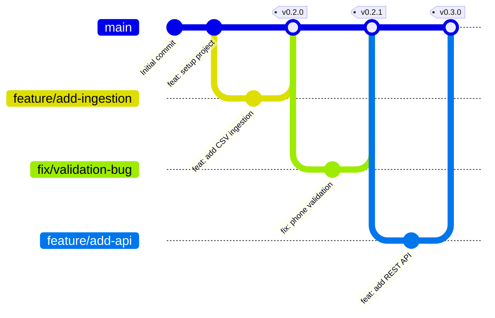
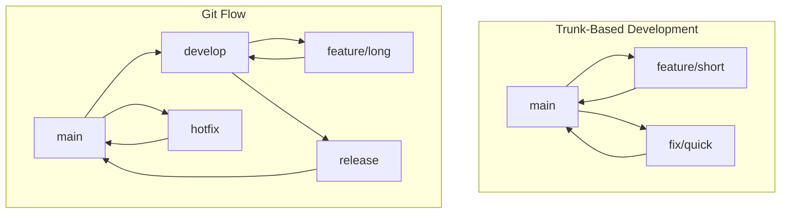
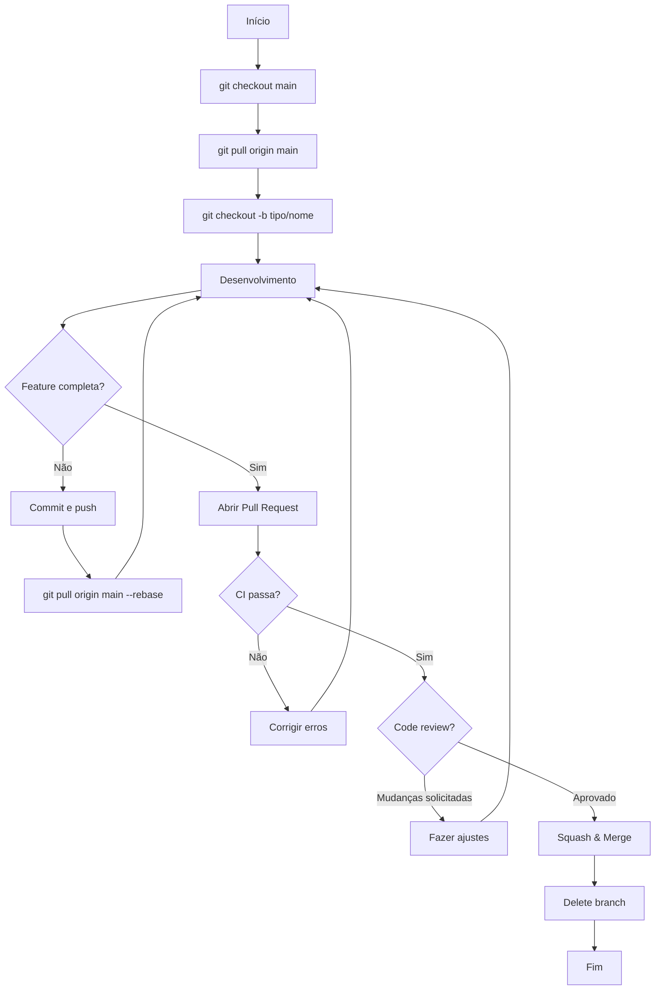
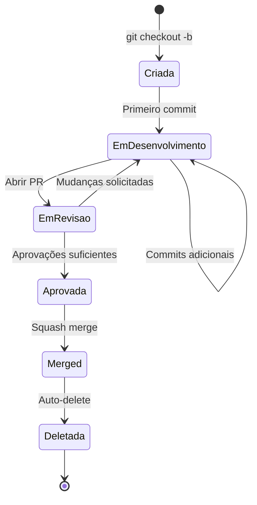
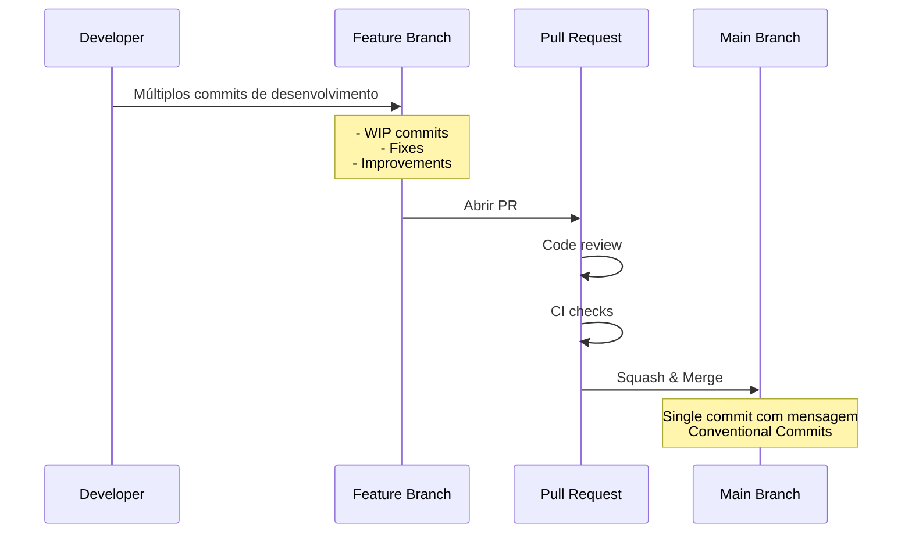
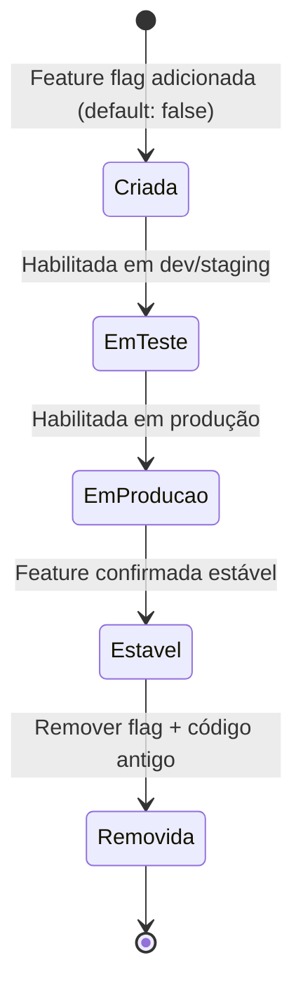

# Estratégia de Branching

## Visão Geral

Este projeto utiliza **Trunk-Based Development** como estratégia de branching. Esta abordagem promove integração contínua, deploys frequentes e reduz complexidade.



## Trunk-Based Development

### Princípios

1. **Uma branch principal**: `main` é a única branch de longa duração
2. **Branches curtas**: Features desenvolvidas em branches de curta duração (1-2 dias)
3. **Integração frequente**: Merge para `main` pelo menos uma vez por dia
4. **Deploy da main**: A branch `main` está sempre em estado deployável
5. **Feature flags**: Funcionalidades incompletas protegidas por feature flags

### Benefícios

| Benefício | Descrição |
|-----------|-----------|
| ⚡ **Feedback rápido** | Problemas de integração descobertos rapidamente |
| 🔄 **Deploy contínuo** | Permite deploys múltiplos por dia |
| 🎯 **Foco** | Reduz overhead mental de gerenciar múltiplas branches |
| 🐛 **Menos bugs** | Conflitos de merge minimizados |
| 👥 **Colaboração** | Time trabalha no mesmo código, reduz silos |

### Comparação com Outras Estratégias



| Aspecto | Trunk-Based | Git Flow | GitHub Flow |
|---------|-------------|----------|-------------|
| **Complexidade** | 🟢 Baixa | 🔴 Alta | 🟡 Média |
| **Duração de branches** | 1-2 dias | Semanas | Dias/semanas |
| **Integração** | Contínua | Periódica | Frequente |
| **Ideal para** | CI/CD, deploys frequentes | Releases programados | Projetos médios |
| **Curva de aprendizado** | 🟢 Fácil | 🔴 Difícil | 🟡 Média |

## Fluxo de Trabalho

### 1. Sincronize com Main

Sempre comece sincronizando sua cópia local:

```bash
git checkout main
git pull origin main
```

### 2. Crie uma Branch Curta

```bash
git checkout -b feature/adiciona-validacao-csv
```

### 3. Desenvolva e Commite

```bash
# Faça mudanças
git add .
git commit -m "feat(validation): adiciona validação de CSV"

# Sincronize frequentemente
git pull origin main --rebase
git push origin feature/adiciona-validacao-csv
```

### 4. Abra Pull Request

- Abra PR assim que tiver commits significativos
- Marque como Draft se ainda não está pronto
- Solicite revisão quando completo

### 5. Merge e Delete

```bash
# Após aprovação, o PR é merged via squash
# A branch é deletada automaticamente
```

### Diagrama de Fluxo Completo



## Convenção de Nomenclatura

### Formato

```
<tipo>/<descrição-curta-em-kebab-case>
```

### Tipos Permitidos

| Tipo | Descrição | Exemplo |
|------|-----------|---------|
| `feature/` | Nova funcionalidade | `feature/add-csv-parser` |
| `fix/` | Correção de bug | `fix/phone-validation` |
| `docs/` | Documentação | `docs/update-readme` |
| `refactor/` | Refatoração | `refactor/simplify-dto` |
| `test/` | Testes | `test/add-integration-tests` |
| `chore/` | Manutenção | `chore/update-dependencies` |
| `perf/` | Performance | `perf/optimize-uploads` |

### Regras de Nomenclatura

✅ **Correto:**
```
feature/add-mp3-support
fix/correct-timezone-handling
docs/improve-contributing-guide
refactor/extract-validation-logic
```

❌ **Incorreto:**
```
minha-feature                    # Falta tipo
feature_add_support             # Underscore ao invés de hífen
Feature/Add-Support             # Maiúsculas
feature/adiciona_suporte_mp3    # Muito longo, tem underscores
```

### Dicas para Bons Nomes

- **Seja específico**: `fix/phone-validation` melhor que `fix/bug`
- **Use inglês**: Mantém consistência com código
- **Máximo 50 caracteres**: Facilita visualização
- **Imperativo**: `add` não `adding` ou `added`

## Ciclo de Vida de uma Branch



### Tempo Máximo de Vida

| Tipo | Tempo Máximo | Razão |
|------|--------------|-------|
| `feature/` | 2 dias | Evita divergência |
| `fix/` | 1 dia | Bugs devem ser corrigidos rapidamente |
| `docs/` | 1 dia | Documentação é rápida |
| `refactor/` | 2 dias | Mudanças incrementais |

**Se exceder o tempo:**
- Divida em branches menores
- Use feature flags para código incompleto
- Considere pair programming

## Proteção de Branch

### Regras para `main`

A branch `main` tem as seguintes proteções:

#### 1. Require Pull Request

- ✅ Pelo menos 1 aprovação obrigatória
- ✅ Aprovar novamente após novos commits
- ✅ Dismiss stale reviews

#### 2. Require Status Checks

- ✅ Testes automatizados devem passar
- ✅ Linting deve passar
- ✅ Security scans devem passar
- ✅ Branch deve estar atualizada com `main`

#### 3. Require Commit Signature

- ✅ Commits devem ser assinados (GPG)

#### 4. Restrict Push

- ❌ Push direto não permitido
- ✅ Apenas via Pull Request
- ✅ Admins também seguem regras

#### 5. Force Push

- ❌ Force push bloqueado
- ❌ Deletar branch bloqueado

### Configuração no GitHub

```yaml
# .github/settings.yml (exemplo com probot/settings)
branches:
  - name: main
    protection:
      required_pull_request_reviews:
        required_approving_review_count: 1
        dismiss_stale_reviews: true
        require_code_owner_reviews: true
      required_status_checks:
        strict: true
        contexts:
          - "test"
          - "lint"
          - "security-scan"
      enforce_admins: true
      required_linear_history: true
      restrictions: null
```

## Estratégia de Merge

### Squash Merge (Padrão)

Este projeto usa **squash merge** exclusivamente.

#### O que é Squash Merge?

Combina todos os commits de uma branch em um único commit na `main`.

**Antes (branch):**
```
* abc123 - WIP: adiciona validação
* def456 - fix: corrige typo
* ghi789 - feat: adiciona validação completa
```

**Depois (main):**
```
* jkl012 - feat(validation): adiciona validação de CSV (#123)
```

#### Vantagens

| Vantagem | Descrição |
|----------|-----------|
| 📖 **Histórico limpo** | Um commit por feature na main |
| 🔍 **Fácil bisect** | Cada commit representa uma mudança completa |
| 🔄 **Fácil revert** | Reverter feature inteira com um comando |
| 📝 **Mensagens claras** | Mensagem de merge segue Conventional Commits |

#### Desvantagens (e mitigações)

| Desvantagem | Mitigação |
|-------------|-----------|
| Perde histórico de commits individuais | Commits intermediários visíveis no PR |
| Não ideal para code archaeology | Use PR para ver desenvolvimento |

### Como Funciona



### Mensagem de Merge

Ao fazer squash merge, a mensagem final deve seguir [Conventional Commits](CONVENTIONAL_COMMITS.md):

```
feat(validation): adiciona validação de arquivos CSV

Implementa parser e validador para arquivos CSV usando pandas.
Inclui validação de schema e tipos de dados.

Closes #123
```

### Comandos

#### Via GitHub UI

1. Clique em "Squash and merge" no PR
2. Edite a mensagem de commit seguindo Conventional Commits
3. Confirme

#### Via CLI (se necessário)

```bash
# Na branch main
git merge --squash feature/minha-branch
git commit -m "feat(scope): descrição da mudança"
git push origin main
```

## Feature Flags

Para funcionalidades que levam mais de 2 dias, use feature flags.

### Exemplo com Python

```python
# config.py
FEATURE_FLAGS = {
    "enable_new_csv_parser": False,
    "enable_ml_predictions": False,
}

# usage.py
from config import FEATURE_FLAGS

def process_file(file_path):
    if FEATURE_FLAGS["enable_new_csv_parser"]:
        return new_csv_parser(file_path)
    else:
        return legacy_parser(file_path)
```

### Exemplo com Variáveis de Ambiente

```python
import os

ENABLE_NEW_FEATURE = os.getenv("ENABLE_NEW_FEATURE", "false").lower() == "true"

if ENABLE_NEW_FEATURE:
    # Código novo
    pass
else:
    # Código antigo
    pass
```

### Ciclo de Vida de Feature Flags



### Melhores Práticas

- ✅ Nomeie flags claramente: `enable_csv_validation_v2`
- ✅ Documente flags em README ou config
- ✅ Remova flags após feature estar estável
- ✅ Use ferramentas de feature flag management (Launch Darkly, etc.) para produção
- ❌ Não acumule flags antigas

## Cenários Comuns

### Cenário 1: Feature Simples

```bash
# 1. Criar branch
git checkout -b feature/add-logging

# 2. Desenvolver
# ... fazer mudanças ...
git add .
git commit -m "feat(logging): adiciona logging estruturado"

# 3. Push e PR
git push origin feature/add-logging
# Abrir PR no GitHub

# 4. Merge via UI
# Squash merge após aprovação
```

### Cenário 2: Bug Urgente

```bash
# 1. Criar branch de fix
git checkout -b fix/security-vulnerability

# 2. Corrigir rapidamente
# ... fazer correção ...
git add .
git commit -m "fix(security): corrige injeção SQL"

# 3. PR fast-track
git push origin fix/security-vulnerability
# Abrir PR marcado como urgente
# Solicitar review imediato

# 4. Merge assim que aprovado
```

### Cenário 3: Feature Grande

```bash
# 1. Quebrar em partes menores
git checkout -b feature/csv-part1-schema

# 2. Implementar parte 1 com feature flag
# ... implementar schema ...
git commit -m "feat(csv): adiciona schema (feature flag)"
# PR e merge

# 3. Próxima parte
git checkout -b feature/csv-part2-parser
# ... implementar parser ...
git commit -m "feat(csv): adiciona parser (feature flag)"
# PR e merge

# 4. Habilitar feature
git checkout -b feature/csv-enable
# ... habilitar flag ...
git commit -m "feat(csv): habilita novo parser CSV"
# PR e merge
```

### Cenário 4: Conflito de Merge

```bash
# Durante desenvolvimento, main foi atualizada
git checkout feature/minha-branch
git pull origin main --rebase

# Se houver conflitos
# Resolver conflitos manualmente
git add .
git rebase --continue

# Push (force with lease por causa do rebase)
git push origin feature/minha-branch --force-with-lease
```

## Troubleshooting

### Branch ficou desatualizada

```bash
git checkout feature/minha-branch
git pull origin main --rebase
git push --force-with-lease
```

### Commit na branch errada

```bash
# Se ainda não fez push
git reset HEAD~1  # Desfaz último commit
git stash         # Salva mudanças
git checkout branch-correta
git stash pop     # Aplica mudanças
git add .
git commit
```

### Preciso dividir branch grande

```bash
# Opção 1: Cherry-pick commits específicos
git checkout -b feature/parte1
git cherry-pick abc123 def456
git push origin feature/parte1

# Opção 2: Reset e recomitar
git checkout -b feature/parte1
git reset --soft main
# Adicionar apenas arquivos da parte 1
git add src/module1/
git commit -m "feat: parte 1"
```

## Recursos Adicionais

- [Trunk Based Development](https://trunkbaseddevelopment.com/)
- [Conventional Commits](CONVENTIONAL_COMMITS.md)
- [Pull Request Guide](PULL_REQUEST_GUIDE.md)

## Perguntas Frequentes

### Posso criar branches de longa duração?

Não. Branches devem durar no máximo 2 dias. Use feature flags para funcionalidades maiores.

### E se minha feature levar 1 semana?

Quebre em partes menores ou use feature flags. Integre incrementalmente.

### Posso fazer commit direto na main?

Não. Mesmo admins devem usar PRs.

### Quando usar rebase vs merge?

Use `rebase` ao atualizar sua branch com main. O merge final será squash.

### Como reverter uma mudança?

```bash
git revert <commit-hash>
# Ou via GitHub UI
```

---

**Última atualização:** 2026-02-12  
**Versão:** 1.0.0
