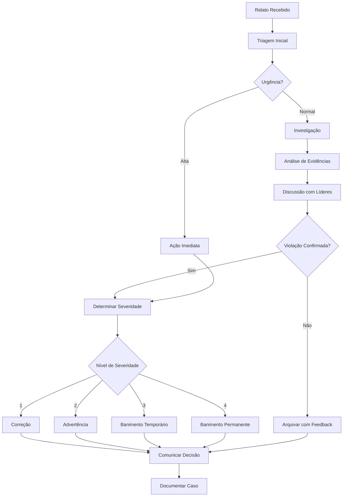

# Código de Conduta

## Nosso Compromisso

Nós, como membros, colaboradores e líderes, nos comprometemos a fazer da participação em nossa comunidade uma experiência livre de assédio para todos, independentemente de idade, tamanho corporal, deficiência visível ou invisível, etnia, características sexuais, identidade e expressão de gênero, nível de experiência, educação, status socioeconômico, nacionalidade, aparência pessoal, raça, casta, cor, religião ou identidade e orientação sexual.

Comprometemo-nos a agir e interagir de maneiras que contribuam para uma comunidade aberta, acolhedora, diversa, inclusiva e saudável.

## Nossos Padrões

Exemplos de comportamentos que contribuem para criar um ambiente positivo incluem:

- ✅ Demonstrar empatia e gentileza com outras pessoas
- ✅ Respeitar opiniões, pontos de vista e experiências diferentes
- ✅ Dar e receber feedback construtivo de forma elegante
- ✅ Assumir responsabilidade e pedir desculpas aos afetados por nossos erros, e aprender com a experiência
- ✅ Focar no que é melhor não apenas para nós como indivíduos, mas para a comunidade como um todo
- ✅ Usar linguagem acolhedora e inclusiva

Exemplos de comportamentos inaceitáveis incluem:

- ❌ Uso de linguagem ou imagens sexualizadas e atenção ou investidas sexuais de qualquer tipo
- ❌ Comentários insultuosos ou depreciativos (*trolling*) e ataques pessoais ou políticos
- ❌ Assédio público ou privado
- ❌ Publicar informações privadas de outras pessoas, como endereço físico ou de e-mail, sem permissão explícita
- ❌ Conduta que poderia ser razoavelmente considerada inadequada em um ambiente profissional

## Responsabilidades de Aplicação

Os líderes da comunidade são responsáveis por esclarecer e fazer cumprir nossos padrões de comportamento aceitável e tomarão ações corretivas apropriadas e justas em resposta a qualquer comportamento que considerem inadequado, ameaçador, ofensivo ou prejudicial.

Os líderes da comunidade têm o direito e a responsabilidade de remover, editar ou rejeitar comentários, commits, código, edições de wiki, issues e outras contribuições que não estejam alinhadas com este Código de Conduta, e comunicarão os motivos das decisões de moderação quando apropriado.

## Escopo

Este Código de Conduta se aplica em todos os espaços da comunidade e também quando um indivíduo está representando oficialmente a comunidade em espaços públicos. Exemplos de representação da nossa comunidade incluem:

- Uso de um endereço de e-mail oficial
- Postagem através de uma conta oficial em mídias sociais
- Atuação como representante designado em um evento online ou offline

## Aplicação

### Como Reportar

Casos de comportamento abusivo, de assédio ou de outra forma inaceitável podem ser reportados aos líderes da comunidade responsáveis pela aplicação em:

- **E-mail:** arquitetura@sabesp.com.br
- **Canal do Teams:** Arquitetura - Código de Conduta

Todas as reclamações serão analisadas e investigadas de forma rápida e justa.

### Confidencialidade

Todos os líderes da comunidade são obrigados a respeitar a privacidade e a segurança de quem reportar qualquer incidente.

## Diretrizes de Aplicação

Os líderes da comunidade seguirão estas Diretrizes de Impacto na Comunidade para determinar as consequências de qualquer ação que considerem violar este Código de Conduta:

### 1. Correção

**Impacto na Comunidade:** Uso de linguagem inadequada ou outro comportamento considerado não profissional ou indesejado na comunidade.

**Consequência:** Advertência privada por escrito dos líderes da comunidade, fornecendo clareza sobre a natureza da violação e uma explicação de por que o comportamento foi inadequado. Um pedido público de desculpas pode ser solicitado.

### 2. Advertência

**Impacto na Comunidade:** Violação através de um único incidente ou série de ações.

**Consequência:** Advertência com consequências para comportamento contínuo. Nenhuma interação com as pessoas envolvidas, incluindo interação não solicitada com aqueles que aplicam o Código de Conduta, por um período especificado de tempo. Isso inclui evitar interações em espaços da comunidade, bem como canais externos como mídias sociais. Violar estes termos pode levar a um banimento temporário ou permanente.

### 3. Banimento Temporário

**Impacto na Comunidade:** Violação grave dos padrões da comunidade, incluindo comportamento inadequado contínuo.

**Consequência:** Banimento temporário de qualquer tipo de interação ou comunicação pública com a comunidade por um período especificado de tempo. Nenhuma interação pública ou privada com as pessoas envolvidas, incluindo interação não solicitada com aqueles que aplicam o Código de Conduta, é permitida durante este período. Violar estes termos pode levar a um banimento permanente.

### 4. Banimento Permanente

**Impacto na Comunidade:** Demonstrar um padrão de violação dos padrões da comunidade, incluindo comportamento inadequado contínuo, assédio a um indivíduo ou agressão ou depreciação de classes de indivíduos.

**Consequência:** Banimento permanente de qualquer tipo de interação pública dentro da comunidade.

## Processo de Resposta a Incidentes

### Prazos de Resposta

| Severidade | Tempo de Resposta Inicial | Tempo de Resolução |
|------------|---------------------------|---------------------|
| 🔴 Crítico | 2 horas | 24 horas |
| 🟡 Alto | 8 horas | 3 dias |
| 🟢 Normal | 24 horas | 7 dias |

## Atribuição

Este Código de Conduta é adaptado do [Contributor Covenant](https://www.contributor-covenant.org), versão 2.1, disponível em [https://www.contributor-covenant.org/version/2/1/code_of_conduct.html](https://www.contributor-covenant.org/version/2/1/code_of_conduct.html).

As Diretrizes de Impacto na Comunidade foram inspiradas pela [escada de aplicação do código de conduta da Mozilla](https://github.com/mozilla/diversity).

Para respostas a perguntas comuns sobre este código de conduta, veja as Perguntas Frequentes em [https://www.contributor-covenant.org/faq](https://www.contributor-covenant.org/faq). Traduções estão disponíveis em [https://www.contributor-covenant.org/translations](https://www.contributor-covenant.org/translations).

## Compromisso da Organização

A Sabesp está comprometida em:

- 🤝 Promover um ambiente de trabalho diverso e inclusivo
- 📚 Fornecer treinamento contínuo sobre diversidade e inclusão
- 🔍 Revisar e atualizar regularmente este Código de Conduta
- ⚖️ Aplicar as diretrizes de forma justa e consistente
- 🛡️ Proteger a privacidade e segurança de todos os membros da comunidade

## Contato

Para questões relacionadas a este Código de Conduta:

- **Time de Arquitetura:** arquitetura@sabesp.com.br
- **RH - Compliance:** compliance@sabesp.com.br
- **Canal de Denúncias:** [Canal de Ética Sabesp]

---

**Última atualização:** 2026-02-12  
**Versão:** 2.1  
**Baseado em:** Contributor Covenant 2.1
