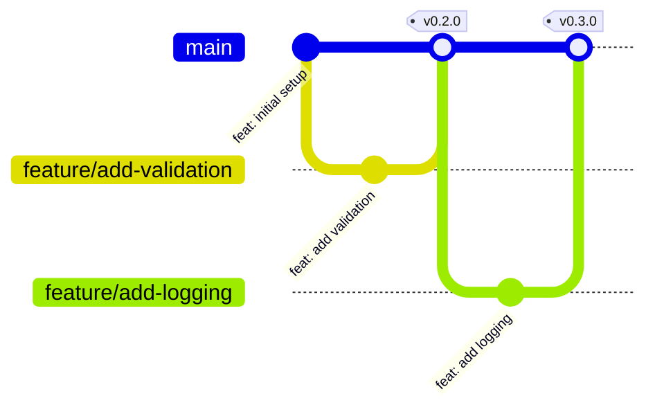
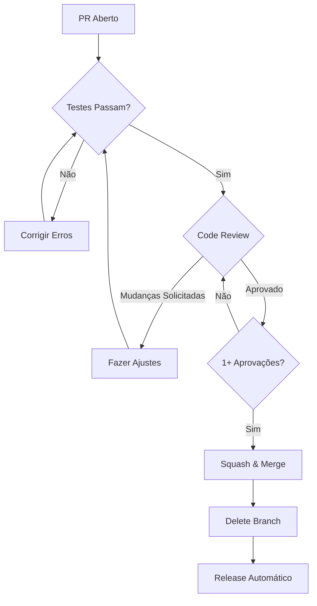
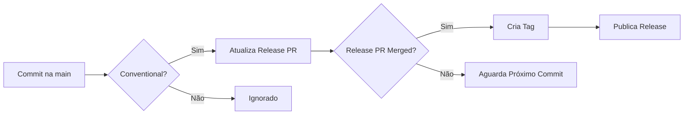

# Guia de Contribuição

Bem-vindo ao projeto de Pipelines de Ingestão de Dados! Este guia fornece todas as informações necessárias para contribuir com o projeto de forma eficaz e consistente.

## 📋 Índice

1. [Visão Geral](#visão-geral)
2. [Configuração do Ambiente](#configuração-do-ambiente)
3. [Fluxo de Trabalho](#fluxo-de-trabalho)
4. [Convenções](#convenções)
5. [Pull Requests](#pull-requests)
6. [Code Review](#code-review)
7. [Releases](#releases)

## Visão Geral

### Trunk-Based Development

Este projeto utiliza **Trunk-Based Development** como estratégia de branching. Isso significa:

- ✅ Branches de curta duração (1-2 dias máximo)
- ✅ Integração frequente na branch `main`
- ✅ Feature flags para funcionalidades incompletas
- ✅ Deploy contínuo a partir da `main`



### Times e Responsabilidades

| Time | Responsabilidade |
|------|------------------|
| **Arquitetura** | Revisão de toda a codebase, decisões arquiteturais |
| **Tech Leads** | Revisão de configurações, CI/CD, padrões de código |
| **Dados** | Pipelines de dados, transformações, qualidade de dados |
| **IA** | Modelos de ML, notebooks, experimentos |

## Configuração do Ambiente

### Pré-requisitos

- Python 3.10 ou superior
- Git
- Azure CLI
- Acesso ao Azure DevOps/GitHub da Sabesp

### Setup Local

1. **Clone o repositório**

```bash
git clone https://github.com/kayaman/app_data_ingestion_pipelines.git
cd app_data_ingestion_pipelines
```

2. **Configure o ambiente Python**

```bash
python -m venv venv
source venv/bin/activate  # No Windows: venv\Scripts\activate
pip install -r requirements.txt
pip install -r requirements-dev.txt  # Dependências de desenvolvimento
```

3. **Configure as credenciais do Azure**

```bash
az login
az account set --subscription "sua-subscription"
```

4. **Configure o Git**

```bash
git config user.name "Seu Nome"
git config user.email "seu.email@sabesp.com.br"
```

## Fluxo de Trabalho

### 1. Sincronize com a Main

Sempre comece sincronizando sua branch local com a `main`:

```bash
git checkout main
git pull origin main
```

### 2. Crie uma Branch

Siga a [convenção de nomenclatura de branches](BRANCHING_STRATEGY.md):

```bash
git checkout -b feature/nome-descritivo
# ou
git checkout -b fix/correção-específica
```

### 3. Faça Commits Seguindo o Padrão

Utilize [Conventional Commits](CONVENTIONAL_COMMITS.md):

```bash
git add .
git commit -m "feat: adiciona validação de arquivos JSON"
```

### 4. Push e Abra um Pull Request

```bash
git push origin feature/nome-descritivo
```

Depois, abra um PR no GitHub seguindo o [template de PR](.github/PULL_REQUEST_TEMPLATE.md).

### 5. Code Review

Aguarde a revisão do seu código. Veja [Processo de Code Review](#code-review).

### 6. Merge

Após aprovação, o PR será merged usando **squash merge**.

## Convenções

### Nomenclatura de Branches

Formato: `<tipo>/<descrição-curta>`

**Tipos permitidos:**
- `feature/` - Nova funcionalidade
- `fix/` - Correção de bug
- `docs/` - Alterações em documentação
- `refactor/` - Refatoração de código
- `test/` - Adição ou alteração de testes
- `chore/` - Tarefas de manutenção

**Exemplos:**
- ✅ `feature/add-csv-ingestion`
- ✅ `fix/audio-file-validation`
- ✅ `docs/update-readme`
- ❌ `minha-branch` (falta tipo)
- ❌ `feature_add_validation` (usa underscore)

### Mensagens de Commit

Siga o padrão [Conventional Commits](CONVENTIONAL_COMMITS.md):

```
<tipo>(<escopo>): <descrição>

[corpo opcional]

[rodapé opcional]
```

**Exemplos:**
```
feat(ingestion): adiciona suporte para arquivos CSV

Implementa parser CSV usando pandas para processar
relatórios diários do sistema interno.

Closes #123
```

```
fix(validation): corrige validação de telefone

O validador não estava aceitando números com DDD 11.

Fixes #456
```

### Código Python

- Siga PEP 8
- Use type hints
- Docstrings em português brasileiro
- Máximo de 100 caracteres por linha
- Use `black` para formatação automática
- Use `ruff` para linting

```python
def processar_arquivo(caminho: str, validar: bool = True) -> dict:
    """
    Processa um arquivo de metadados JSON.
    
    Args:
        caminho: Caminho completo para o arquivo JSON
        validar: Se True, valida o schema do arquivo
        
    Returns:
        Dicionário com os metadados processados
        
    Raises:
        FileNotFoundError: Se o arquivo não existir
        ValidationError: Se a validação falhar
    """
    # implementação
    pass
```

## Pull Requests

### Antes de Abrir um PR

- [ ] Código segue as convenções do projeto
- [ ] Todos os testes passam localmente
- [ ] Documentação foi atualizada (se necessário)
- [ ] Commits seguem Conventional Commits
- [ ] Branch está atualizada com `main`

### Template de PR

Use o template automático que será preenchido ao criar o PR. Certifique-se de:

1. Preencher a descrição detalhadamente
2. Marcar o tipo de alteração
3. Referenciar issues relacionadas
4. Completar o checklist

### Processo de Aprovação



## Code Review

### Para Autores

- Mantenha PRs pequenos (< 400 linhas quando possível)
- Forneça contexto suficiente na descrição
- Responda aos comentários prontamente
- Agradeça os revisores pelo tempo dedicado
- Não leve feedback como crítica pessoal

### Para Revisores

#### O que Verificar

- [ ] Código está claro e legível
- [ ] Lógica está correta
- [ ] Testes cobrem casos relevantes
- [ ] Documentação está atualizada
- [ ] Não há vazamento de credenciais
- [ ] Performance não foi degradada
- [ ] Segue padrões do projeto

#### Como Fornecer Feedback

✅ **Bom Feedback:**
```
Sugestão: Podemos usar um dict comprehension aqui para melhorar
a legibilidade:
`resultado = {k: v for k, v in items if v is not None}`
```

❌ **Feedback Inadequado:**
```
Isso está errado.
```

### Tempo de Resposta

| Prioridade | SLA de Resposta |
|------------|-----------------|
| 🔴 Crítico | 4 horas |
| 🟡 Normal | 24 horas |
| 🟢 Baixa | 48 horas |

## Releases

### Automação com Release Please

Este projeto usa [release-please](https://github.com/googleapis/release-please) para automação de releases.

### Como Funciona

1. Você faz commit seguindo Conventional Commits
2. Ao fazer merge na `main`, o release-please analisa os commits
3. Um PR de release é criado/atualizado automaticamente
4. Quando o PR de release é merged, uma nova versão é publicada



### Versionamento

Seguimos [Semantic Versioning](SEMANTIC_VERSIONING.md):

- `feat:` → incrementa MINOR (0.1.0 → 0.2.0)
- `fix:` → incrementa PATCH (0.1.0 → 0.1.1)
- `BREAKING CHANGE:` → incrementa MAJOR (0.1.0 → 1.0.0)

### Exemplo de Commit que Gera Release

```
feat(api): adiciona endpoint de health check

Implementa endpoint GET /health que retorna status do serviço.

Closes #789
```

Esse commit irá:
1. Incrementar a versão MINOR (ex: 0.2.0 → 0.3.0)
2. Adicionar entrada no CHANGELOG.md
3. Criar/atualizar o PR de release

## Dúvidas?

- Consulte os outros documentos em [/docs](.)
- Abra uma issue com a tag `question`
- Entre em contato com o time de Arquitetura

## Referências

- [Conventional Commits](CONVENTIONAL_COMMITS.md)
- [Semantic Versioning](SEMANTIC_VERSIONING.md)
- [Branching Strategy](BRANCHING_STRATEGY.md)
- [Pull Request Guide](PULL_REQUEST_GUIDE.md)
- [Código de Conduta](CODE_OF_CONDUCT.md)
