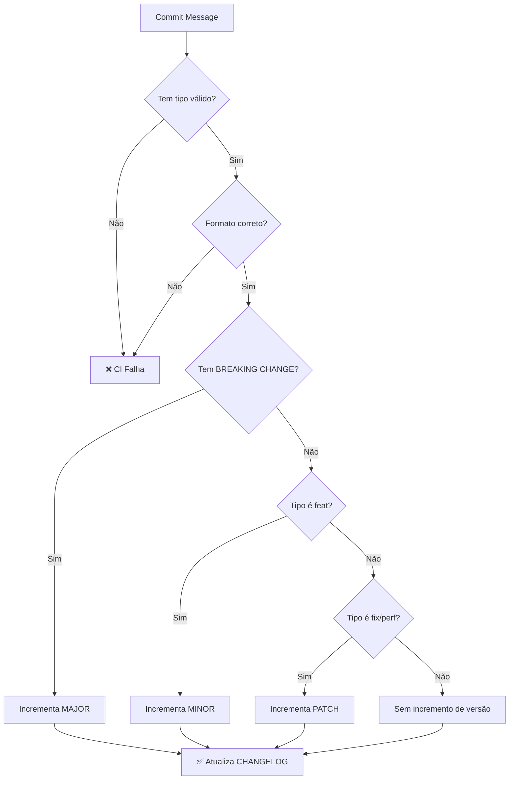

# Conventional Commits

## Visão Geral

Este projeto segue a especificação [Conventional Commits](https://www.conventionalcommits.org/) para mensagens de commit. Isso permite:

- 🤖 Geração automática de CHANGELOGs
- 🏷️ Versionamento semântico automático
- 📝 Histórico de commits mais legível
- 🔍 Facilidade para encontrar mudanças específicas
- ⚡ Automação de releases

## Formato da Mensagem

### Estrutura Básica

```
<tipo>(<escopo>): <descrição>

[corpo opcional]

[rodapé opcional]
```

### Componentes

#### 1. Header (Obrigatório)

```
<tipo>(<escopo>): <descrição>
```

- **tipo**: Categoria da mudança (obrigatório)
- **escopo**: Área do código afetada (opcional)
- **descrição**: Breve descrição da mudança (obrigatório)

**Regras:**
- Máximo de 72 caracteres
- Usar minúsculas
- Sem ponto final
- Imperativo ("adiciona" não "adicionado")

#### 2. Body (Opcional)

Explicação detalhada da mudança. Use para:
- Motivação da mudança
- Contraste com comportamento anterior
- Detalhes técnicos relevantes

**Regras:**
- Separado do header por uma linha em branco
- Pode ter múltiplos parágrafos
- Máximo de 100 caracteres por linha

#### 3. Footer (Opcional)

Informações sobre breaking changes e referências a issues.

**Regras:**
- Separado do body por uma linha em branco
- Formato: `<token>: <valor>`
- Tokens comuns: `BREAKING CHANGE`, `Refs`, `Closes`, `Fixes`

## Tipos Permitidos

### feat (Feature)

**Descrição:** Nova funcionalidade para o usuário final.

**Impacto:** Incrementa versão MINOR (0.1.0 → 0.2.0)

**Exemplos:**
```
feat(ingestion): adiciona suporte para arquivos CSV

Implementa parser CSV para ingestão de relatórios
diários do sistema interno usando pandas.

Closes #123
```

```
feat: adiciona validação de integridade de arquivos WAV
```

### fix (Bug Fix)

**Descrição:** Correção de bug.

**Impacto:** Incrementa versão PATCH (0.1.0 → 0.1.1)

**Exemplos:**
```
fix(validation): corrige validação de números de telefone

O validador não estava aceitando números com DDD 11.
Ajustado regex para aceitar DDDs de 2 dígitos.

Fixes #456
```

```
fix: corrige timeout em upload de arquivos grandes
```

### docs (Documentation)

**Descrição:** Alterações apenas em documentação.

**Impacto:** Não gera nova versão (a menos que configurado)

**Exemplos:**
```
docs: atualiza guia de contribuição com exemplos

Adiciona seção sobre como configurar ambiente local
e exemplos de commits válidos.
```

```
docs(readme): corrige links quebrados
```

### style (Code Style)

**Descrição:** Mudanças que não afetam o significado do código (espaços, formatação, ponto e vírgula, etc.)

**Impacto:** Não gera nova versão

**Exemplos:**
```
style: formata código com black

Aplica formatação automática em todo o projeto
seguindo PEP 8.
```

```
style(dto): remove espaços em branco extras
```

### refactor (Refactoring)

**Descrição:** Mudança no código que não corrige bug nem adiciona funcionalidade.

**Impacto:** Não gera nova versão (ou incrementa PATCH se configurado)

**Exemplos:**
```
refactor(parser): simplifica lógica de validação

Substitui múltiplos if-else por pattern matching
para melhor legibilidade.
```

```
refactor: extrai função de sanitização de uniqueid
```

### perf (Performance)

**Descrição:** Mudança que melhora performance.

**Impacto:** Incrementa versão PATCH

**Exemplos:**
```
perf(storage): otimiza upload de arquivos grandes

Implementa upload em chunks de 4MB ao invés de
carregar arquivo completo na memória.

Reduz uso de memória em 70% para arquivos > 100MB.
```

```
perf: adiciona índice em coluna dt_chamada
```

### test (Tests)

**Descrição:** Adição ou correção de testes.

**Impacto:** Não gera nova versão

**Exemplos:**
```
test(dto): adiciona testes para ChamadaDTO

Cobre cenários de validação de telefone,
datas e durações.

Coverage: 95%
```

```
test: adiciona testes de integração para pipeline
```

### build (Build)

**Descrição:** Mudanças no sistema de build ou dependências externas.

**Impacto:** Não gera nova versão (ou incrementa PATCH se configurado)

**Exemplos:**
```
build: atualiza pydantic de 2.5.0 para 2.6.0

Nova versão inclui melhorias de performance
e correções de bugs.
```

```
build(deps): adiciona azure-storage-blob
```

### ci (CI/CD)

**Descrição:** Mudanças em arquivos e scripts de CI/CD.

**Impacto:** Não gera nova versão

**Exemplos:**
```
ci: adiciona workflow de testes automatizados

Configura GitHub Actions para rodar testes
em Python 3.10, 3.11 e 3.12.
```

```
ci(release): configura release-please
```

### chore (Maintenance)

**Descrição:** Outras mudanças que não modificam código fonte ou testes.

**Impacto:** Não gera nova versão

**Exemplos:**
```
chore: atualiza .gitignore para excluir venv
```

```
chore(deps): atualiza dependências de desenvolvimento
```

### revert (Revert)

**Descrição:** Reverte um commit anterior.

**Impacto:** Depende do commit revertido

**Formato:**
```
revert: <header do commit revertido>

This reverts commit <hash>.
```

**Exemplo:**
```
revert: feat(api): adiciona endpoint de health check

This reverts commit 123abc456def.

O endpoint causou conflito com monitoramento existente.
```

## Escopos Recomendados

Escopos comuns para este projeto:

| Escopo | Descrição | Exemplos |
|--------|-----------|----------|
| `ingestion` | Pipeline de ingestão | `feat(ingestion): adiciona retry logic` |
| `validation` | Validação de dados | `fix(validation): corrige regex de telefone` |
| `storage` | Armazenamento Azure | `perf(storage): otimiza uploads` |
| `dto` | Modelos de dados | `refactor(dto): simplifica ChamadaDTO` |
| `transform` | Transformação de dados | `feat(transform): adiciona normalização` |
| `ml` | Machine Learning | `feat(ml): adiciona modelo de classificação` |
| `api` | APIs | `feat(api): adiciona endpoint de status` |
| `infra` | Infraestrutura | `chore(infra): atualiza terraform` |
| `ci` | CI/CD | `ci: adiciona lint de commits` |
| `docs` | Documentação | `docs: atualiza README` |

## Breaking Changes

### O que é um Breaking Change?

Qualquer mudança que quebra compatibilidade com versões anteriores:

- Remoção de funcionalidades
- Mudança em assinaturas de funções públicas
- Mudança no formato de dados
- Remoção de suporte a versões
- Mudanças em configurações obrigatórias

### Como Indicar

Adicione `BREAKING CHANGE:` no rodapé OU `!` após o tipo/escopo:

**Opção 1: Footer**
```
feat(api): renomeia endpoint de /calls para /chamadas

BREAKING CHANGE: O endpoint /calls foi renomeado para /chamadas
para melhor refletir a nomenclatura em português.

Migração: Atualizar todas as chamadas de /calls para /chamadas.
```

**Opção 2: ! no Header**
```
feat(dto)!: remove campo legacy uniqueid_antigo

Remove campo depreciado que não é mais utilizado.

BREAKING CHANGE: Campo uniqueid_antigo removido do ChamadaDTO.
```

**Impacto:** Incrementa versão MAJOR (0.9.0 → 1.0.0)

## Exemplos Corretos e Incorretos

### ✅ Correto

```
feat(ingestion): adiciona suporte para arquivos MP3

Implementa decodificação de arquivos MP3 usando pydub.
Mantém compatibilidade com WAV existente.

Closes #789
```

**Razões:**
- Tipo claro (feat)
- Escopo específico (ingestion)
- Descrição concisa no imperativo
- Body explica implementação
- Referência a issue

### ✅ Correto

```
fix: corrige crash ao processar arquivo vazio

Adiciona validação de tamanho antes de processar
arquivo para evitar exceção não tratada.

Fixes #234
```

**Razões:**
- Tipo apropriado (fix)
- Descrição clara
- Explica a solução
- Referência a issue

### ❌ Incorreto

```
added new feature
```

**Problemas:**
- Sem tipo
- Tempo verbal errado (passado)
- Descrição vaga

### ❌ Incorreto

```
feat: Added support for CSV files, updated documentation, fixed bug in validation
```

**Problemas:**
- Tempo verbal errado
- Múltiplas mudanças em um commit
- Deveria ser múltiplos commits

### ❌ Incorreto

```
FIX(VALIDATION): CORRIGE TELEFONE.
```

**Problemas:**
- Maiúsculas (deve ser minúsculas)
- Ponto final no final
- Descrição vaga

## Fluxo de Análise de Commits



## Ferramentas e Automação

### Commit Lint (Local)

Configure no seu ambiente local:

```bash
# Instalar commitlint (Node.js)
npm install -g @commitlint/cli @commitlint/config-conventional

# Criar .commitlintrc.json
echo '{"extends": ["@commitlint/config-conventional"]}' > .commitlintrc.json

# Configurar git hook
npx husky add .husky/commit-msg 'npx --no -- commitlint --edit "$1"'
```

### Template de Commit

Configure um template para ajudar:

```bash
git config commit.template ~/.gitmessage
```

Conteúdo de `~/.gitmessage`:
```
# <tipo>(<escopo>): <descrição>
# |<----  Máximo 72 caracteres  ---->|

# [corpo opcional]
# |<----  Máximo 100 caracteres por linha  ---->|

# [rodapé opcional]
# Closes #
# BREAKING CHANGE:

# Tipos permitidos:
#   feat:     Nova funcionalidade
#   fix:      Correção de bug
#   docs:     Documentação
#   style:    Formatação
#   refactor: Refatoração
#   perf:     Performance
#   test:     Testes
#   build:    Build/dependências
#   ci:       CI/CD
#   chore:    Manutenção
#   revert:   Reverter commit
```

### Validação no CI

O CI valida automaticamente as mensagens de commit em cada PR.

## Dicas Práticas

### 1. Commits Atômicos

Cada commit deve representar uma única mudança lógica:

✅ **Bom:**
```
feat(dto): adiciona campo hr_duracao_total
fix(dto): corrige validação de dt_fim
docs(dto): atualiza documentação de ChamadaDTO
```

❌ **Ruim:**
```
feat: adiciona campo, corrige validação e atualiza docs
```

### 2. Commits Frequentes

Commite com frequência ao invés de acumular mudanças:

- Após implementar uma função
- Após corrigir um bug
- Após refatorar um módulo

### 3. Mensagens Descritivas

✅ **Bom:**
```
fix(validation): corrige validação de telefones com DDD 11

O regex anterior não aceitava DDD 11 por estar limitado
a DDDs de 2 dígitos começando com 1-9. Atualizado para
aceitar 11-99.
```

❌ **Ruim:**
```
fix: corrige bug
```

### 4. Use o Body

Sempre que necessário, use o body para dar contexto:

- Por que a mudança foi necessária?
- Qual foi a abordagem escolhida?
- Há alguma limitação ou consideração?

### 5. Referências

Sempre referencie issues relacionadas:

```
Closes #123
Refs #456
Fixes #789
```

## Recursos Adicionais

- [Conventional Commits Spec](https://www.conventionalcommits.org/)
- [Semantic Versioning](SEMANTIC_VERSIONING.md)
- [Como Escrever Boas Mensagens de Commit](https://chris.beams.io/posts/git-commit/)

## Perguntas Frequentes

### Posso fazer merge de múltiplos commits?

Sim! Usamos **squash merge** no PR, então múltiplos commits serão combinados em um único commit na `main`. Certifique-se de que a mensagem final do squash segue o padrão.

### E se eu errar a mensagem?

Antes de push:
```bash
git commit --amend -m "feat: mensagem correta"
```

Depois de push (evite se possível):
```bash
git rebase -i HEAD~1
# Edite a mensagem e force push (apenas em branches de feature)
git push --force-with-lease
```

### Múltiplos tipos na mesma mudança?

Separe em múltiplos commits. Se inevitável, use o tipo predominante.

### Como descrever refatoração grande?

Use escopo e body detalhado:
```
refactor(dto): reestrutura validações

Extrai validações complexas para funções separadas
para melhorar testabilidade e manutenção.

- Cria validator_telefone()
- Cria validator_duracao()
- Atualiza testes unitários

Refs #123
```

---

**Última atualização:** 2026-02-12  
**Versão:** 1.0.0  
**Baseado em:** Conventional Commits 1.0.0
