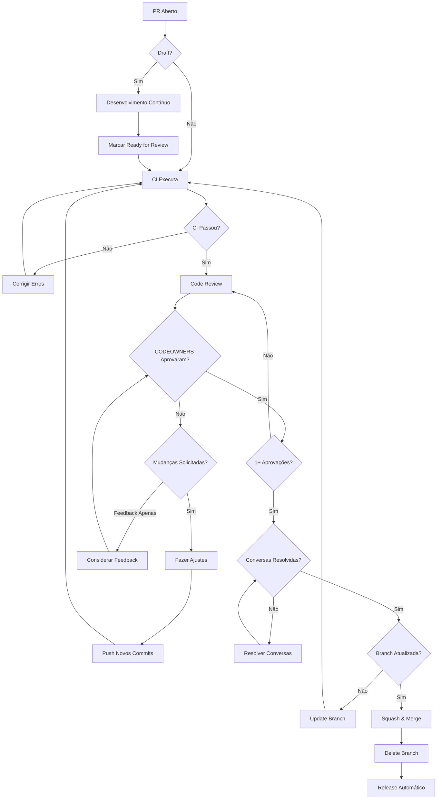

# Guia de Pull Requests

## Visão Geral

Este guia descreve o processo completo de Pull Requests (PRs), desde a criação até o merge, incluindo boas práticas para autores e revisores.

## 📋 Índice

1. [Antes de Abrir um PR](#antes-de-abrir-um-pr)
2. [Criando um Pull Request](#criando-um-pull-request)
3. [Processo de Revisão](#processo-de-revisão)
4. [Boas Práticas](#boas-práticas)
5. [Checklist de Revisão](#checklist-de-revisão)

## Antes de Abrir um PR

### Checklist Pré-PR

Antes de abrir seu Pull Request, certifique-se de que:

- [ ] **Branch está atualizada com `main`**
  ```bash
  git checkout main
  git pull origin main
  git checkout sua-branch
  git rebase main
  ```

- [ ] **Commits seguem Conventional Commits**
  ```bash
  git log --oneline
  # Verificar se mensagens seguem o padrão
  ```

- [ ] **Testes passam localmente**
  ```bash
  pytest
  # ou comando de teste do projeto
  ```

- [ ] **Código está formatado**
  ```bash
  black .
  ruff check .
  ```

- [ ] **Sem conflitos de merge**
  ```bash
  git status
  # Não deve mostrar conflitos
  ```

- [ ] **Documentação atualizada** (se aplicável)
  - README.md
  - Docstrings
  - docs/ relevantes

- [ ] **Não há secrets ou credenciais no código**
  ```bash
  git diff main...HEAD | grep -i "password\|secret\|key\|token"
  ```

## Criando um Pull Request

### 1. Push da Branch

```bash
git push origin feature/sua-funcionalidade
```

### 2. Abrir PR no GitHub

Navegue até o repositório no GitHub. Você verá um banner:

```
feature/sua-funcionalidade had recent pushes
[Compare & pull request]
```

Clique em **Compare & pull request**.

### 3. Preencher o Template

O template de PR será carregado automaticamente. Preencha todas as seções:

```markdown
## Descrição

Breve descrição do que este PR faz.

## Tipo de Alteração

- [ ] 🐛 Bug fix
- [x] ✨ Nova funcionalidade
- [ ] 📝 Atualização de documentação
- [ ] ♻️ Refatoração
- [ ] ⚡ Melhoria de performance
- [ ] ✅ Atualização de testes

## Issue Relacionada

Closes #123

## Checklist

- [x] Código segue as convenções do projeto
- [x] Testes foram adicionados/atualizados
- [x] Documentação foi atualizada
- [x] Não há breaking changes (ou estão documentadas)
- [x] CI está passando

## Screenshots (se aplicável)

<!-- Adicionar screenshots de mudanças de UI -->
```

### 4. Configurar Opções do PR

- **Reviewers:** Selecione revisores (ou deixe CODEOWNERS fazer isso)
- **Assignees:** Atribua a você mesmo
- **Labels:** Adicione labels apropriados
- **Projects:** Adicione a um projeto se aplicável
- **Milestone:** Adicione a um milestone se aplicável

### 5. Draft vs Ready

**Use Draft PR quando:**
- Código ainda está em desenvolvimento
- Quer feedback antecipado
- CI ainda não está passando

**Use Ready for Review quando:**
- Código está completo
- Testes estão passando
- Pronto para revisão formal

## Processo de Revisão

### Fluxo Completo



### Estados do PR

| Estado | Descrição | Ação Necessária |
|--------|-----------|-----------------|
| 🟡 **Draft** | Em desenvolvimento | Continuar desenvolvimento |
| 🔴 **CI Failed** | Testes falharam | Corrigir erros |
| 🟠 **Changes Requested** | Revisores solicitaram mudanças | Fazer ajustes |
| 🟢 **Approved** | Aprovado, aguardando merge | Fazer merge (ou aguardar auto-merge) |
| 🟣 **Merged** | Merged com sucesso | Acompanhar release |
| ⚫ **Closed** | Fechado sem merge | Arquivado |

### Timeline de Revisão

```mermaid
gantt
    title Timeline Típico de um PR
    dateFormat  HH:mm
    axisFormat %H:%M

    section Autor
    Criar PR           :a1, 09:00, 30m
    Aguardar Review    :a2, after a1, 2h
    Fazer Ajustes      :a3, 13:00, 1h
    
    section Revisores
    Primeira Revisão   :r1, 11:00, 1h
    Segunda Revisão    :r2, 14:00, 30m
    
    section CI
    Testes (1ª rodada) :c1, 09:30, 15m
    Testes (2ª rodada) :c2, 14:00, 15m
    
    section Merge
    Aprovação Final    :m1, 14:30, 15m
    Squash Merge       :milestone, m2, 14:45, 0m
```



### SLA de Revisão

| Tipo de PR | Tempo Esperado de Resposta | Urgência |
|------------|----------------------------|----------|
| 🔴 **Hotfix Crítico** | 2-4 horas | Máxima |
| 🟠 **Bug Fix** | 24 horas | Alta |
| 🟡 **Feature** | 48 horas | Normal |
| 🟢 **Docs/Refactor** | 72 horas | Baixa |

## Boas Práticas

### Para Autores

#### 1. Mantenha PRs Pequenos

✅ **Bom: PR Pequeno**
```
Files changed: 5
Additions: 150
Deletions: 50
```

❌ **Ruim: PR Muito Grande**
```
Files changed: 25
Additions: 1500
Deletions: 800
```

**Dica:** Se seu PR está ficando grande, considere dividi-lo em múltiplos PRs menores.

#### 2. Escreva Descrições Claras

✅ **Boa Descrição:**
```markdown
## Descrição

Adiciona validação de arquivos CSV antes do processamento.

**Problema:**
Arquivos CSV malformados causavam crashes silenciosos
durante a ingestão.

**Solução:**
- Implementa validação de schema usando Pydantic
- Adiciona log de erros detalhados
- Retorna erro claro para usuário

**Impacto:**
- Reduz crashes em 100%
- Melhora debugabilidade
- Não afeta performance (validação é rápida)

Closes #456
```

❌ **Má Descrição:**
```markdown
Adiciona validação
```

#### 3. Forneça Contexto

- **Por quê?** - Qual problema está sendo resolvido?
- **O quê?** - O que mudou?
- **Como?** - Como foi implementado?
- **Impacto?** - Qual o impacto da mudança?

#### 4. Adicione Screenshots/GIFs

Para mudanças de UI ou comportamento visível:

```markdown
## Screenshots

### Antes


### Depois

```

#### 5. Responda Prontamente

- Agradeça os revisores
- Responda a comentários em até 24 horas
- Explique decisões quando necessário
- Seja receptivo a feedback

✅ **Boa Resposta:**
```
Obrigado pelo feedback! Você está certo, essa abordagem
é mais limpa. Vou refatorar usando dict comprehension.
```

❌ **Má Resposta:**
```
Não concordo.
```

#### 6. Resolva Conversas Apropriadamente

- **Você resolve:** Quando você fez a mudança solicitada
- **Revisor resolve:** Quando é apenas um comentário/sugestão

#### 7. Mantenha PR Atualizado

```bash
# Regularmente, atualize com main
git fetch origin
git rebase origin/main
git push --force-with-lease
```

### Para Revisores

#### 1. Seja Construtivo

✅ **Feedback Construtivo:**
```
Sugestão: Podemos melhorar a legibilidade extraindo
essa lógica para uma função separada:

def validar_telefone(numero: str) -> bool:
    return numero.isdigit() and len(numero) >= 10

Isso também facilita testar isoladamente.
```

❌ **Feedback Não Construtivo:**
```
Esse código está ruim.
```

#### 2. Use Convenções de Comentários

| Prefixo | Significado | Ação Requerida |
|---------|-------------|----------------|
| **Nit:** | Pequeno detalhe, não bloqueante | Opcional |
| **Suggestion:** | Sugestão de melhoria | Opcional |
| **Question:** | Dúvida/clarificação | Resposta necessária |
| **Issue:** | Problema que deve ser corrigido | Obrigatória |
| **Blocker:** | Problema crítico que impede merge | Obrigatória |

**Exemplos:**
```
Nit: Typo no comentário: "receber" → "recebe"

Suggestion: Considere usar dataclass ao invés de dict
para melhor type safety.

Question: Por que escolheu usar threading aqui ao
invés de asyncio?

Issue: Este código pode causar race condition quando
executado em paralelo.

Blocker: Este código expõe credenciais no log.
DEVE ser corrigido antes do merge.
```

#### 3. Foque no Que Importa

**Priorize:**
- ✅ Correção lógica
- ✅ Segurança
- ✅ Performance crítica
- ✅ Legibilidade

**Não priorize:**
- ❌ Preferências pessoais de estilo (use linter)
- ❌ Mudanças cosméticas
- ❌ Refatorações não relacionadas

#### 4. Aprove ou Solicite Mudanças Claramente

**Review States:**

- **✅ Approve:** Código está pronto para merge
  ```
  LGTM! 🚀
  Código está limpo, testes passam, boa documentação.
  ```

- **💬 Comment:** Feedback não bloqueante
  ```
  Algumas sugestões menores, mas não bloqueante.
  Pode fazer merge e ajustar depois se preferir.
  ```

- **❌ Request Changes:** Mudanças obrigatórias
  ```
  Por favor, corrija o vazamento de memória no
  loop infinito antes do merge.
  ```

#### 5. Seja Específico

✅ **Específico:**
```
Linha 45: Esta query SQL está vulnerável a injection.
Use prepared statements:

cursor.execute("SELECT * FROM users WHERE id = ?", (user_id,))
```

❌ **Vago:**
```
Problema de segurança aqui.
```

#### 6. Reconheça Bom Código

```
💯 Excelente tratamento de erros aqui!
A mensagem é clara e actionable.
```

#### 7. Responda em Tempo Hábil

- Primeira revisão: dentro do SLA
- Re-revisão: dentro de 4 horas após mudanças

## Checklist de Revisão

### Para Autores (Auto-Review)

Antes de marcar como "Ready for Review":

- [ ] **Funcionalidade**
  - [ ] Código faz o que deveria fazer
  - [ ] Edge cases estão cobertos
  - [ ] Erros são tratados apropriadamente

- [ ] **Testes**
  - [ ] Testes unitários adicionados/atualizados
  - [ ] Testes de integração quando necessário
  - [ ] Coverage mantido ou melhorado
  - [ ] Todos os testes passam

- [ ] **Qualidade de Código**
  - [ ] Código é legível e auto-explicativo
  - [ ] Funções são pequenas e focadas
  - [ ] Nomes de variáveis são descritivos
  - [ ] Comentários apenas onde necessário
  - [ ] Sem código comentado/morto
  - [ ] Sem TODOs (ou em issue separada)

- [ ] **Documentação**
  - [ ] Docstrings atualizadas
  - [ ] README.md atualizado se necessário
  - [ ] CHANGELOG (gerado automaticamente)
  - [ ] Exemplos de uso quando aplicável

- [ ] **Performance**
  - [ ] Sem loops desnecessários
  - [ ] Queries otimizadas
  - [ ] Recursos liberados apropriadamente

- [ ] **Segurança**
  - [ ] Sem secrets/credenciais
  - [ ] Input é validado
  - [ ] Output é sanitizado
  - [ ] Sem vulnerabilidades conhecidas

- [ ] **Compatibilidade**
  - [ ] Não quebra funcionalidades existentes
  - [ ] Breaking changes documentadas
  - [ ] Migração documentada se necessário

### Para Revisores

- [ ] **Entendimento**
  - [ ] Entendo o que o PR faz
  - [ ] Entendo por que é necessário
  - [ ] Descrição está clara

- [ ] **Lógica**
  - [ ] Lógica está correta
  - [ ] Implementação faz sentido
  - [ ] Não há race conditions
  - [ ] Edge cases considerados

- [ ] **Testes**
  - [ ] Testes cobrem cenários importantes
  - [ ] Testes são determinísticos
  - [ ] Mocks são apropriados

- [ ] **Qualidade**
  - [ ] Código é legível
  - [ ] Segue padrões do projeto
  - [ ] Sem code smells óbvios
  - [ ] Complexidade é justificada

- [ ] **Documentação**
  - [ ] Código está documentado
  - [ ] Documentação externa atualizada
  - [ ] Comentários são úteis

- [ ] **Segurança**
  - [ ] Sem vulnerabilidades
  - [ ] Validação de input
  - [ ] Tratamento de erros seguro

## Cenários Comuns

### Scenario 1: PR com Mudanças Solicitadas

**Autor:**
```bash
# Fazer mudanças solicitadas
git add .
git commit -m "fix: corrige validação conforme review"
git push
```

**Revisor:**
```
# Comentário no PR
✅ Mudanças aplicadas corretamente. Aprovado!
```

### Scenario 2: PR Precisa Atualizar com Main

```bash
git checkout sua-branch
git fetch origin
git rebase origin/main
# Resolver conflitos se houver
git push --force-with-lease
```

### Scenario 3: PR Draft Recebendo Feedback Antecipado

```markdown
**Autor comenta:**
Este PR ainda está em desenvolvimento, mas gostaria de
feedback sobre a abordagem escolhida antes de continuar.

Especificamente:
1. A estrutura de classes faz sentido?
2. O uso de async/await é apropriado aqui?
```

```markdown
**Revisor responde:**
1. ✅ Estrutura está boa
2. ⚠️ Async pode ser overkill aqui. Considere sync
   primeiro e otimize se necessário.
```

### Scenario 4: Conflito de Opinião

**Se você (autor) discorda do feedback:**

```markdown
Entendo sua preocupação sobre performance, mas escolhi
essa abordagem por [razões X, Y, Z].

Benchmarks mostram que a diferença é < 1% para nosso
caso de uso típico.

Podemos discutir em uma chamada se preferir?
```

**Se persiste o conflito:**
- Escale para tech lead
- Documente prós/contras
- Deixe tech lead decidir

## Comandos Úteis

### Ver Diferenças

```bash
# Ver mudanças locais
git diff

# Ver mudanças vs main
git diff main...HEAD

# Ver arquivos alterados
git diff --name-only main...HEAD

# Ver estatísticas
git diff --stat main...HEAD
```

### Atualizar Branch

```bash
# Opção 1: Rebase (preferido)
git fetch origin
git rebase origin/main

# Opção 2: Merge (se rebase for complicado)
git fetch origin
git merge origin/main
```

### Squash Commits Localmente (se necessário)

```bash
# Interativo
git rebase -i HEAD~3  # Últimos 3 commits

# Ou
git rebase -i main
```

## FAQ

### Quanto tempo devo esperar por revisão?

Veja [SLA de Revisão](#sla-de-revisão). Se exceder, mencione revisores no PR.

### Posso fazer merge do meu próprio PR?

Não, se você é o autor. Exceto em emergências e com aprovação de tech lead.

### Quantas aprovações preciso?

Mínimo 1 aprovação de CODEOWNER relevante.

### O que fazer se CI está falhando?

1. Verifique os logs do CI
2. Reproduza localmente
3. Corrija o erro
4. Push novamente

### Posso fazer force push?

Sim, mas use `--force-with-lease` para segurança:
```bash
git push --force-with-lease
```

### Como resolver conversas?

- **Autor resolve:** Quando implementou a mudança
- **Revisor resolve:** Quando era só comentário/FYI
- **Qualquer um:** Se for acordo mútuo

## Recursos Adicionais

- [Conventional Commits](CONVENTIONAL_COMMITS.md)
- [Branching Strategy](BRANCHING_STRATEGY.md)
- [Contributing Guide](CONTRIBUTING.md)
- [Code of Conduct](CODE_OF_CONDUCT.md)

---

**Última atualização:** 2026-02-12  
**Versão:** 1.0.0
