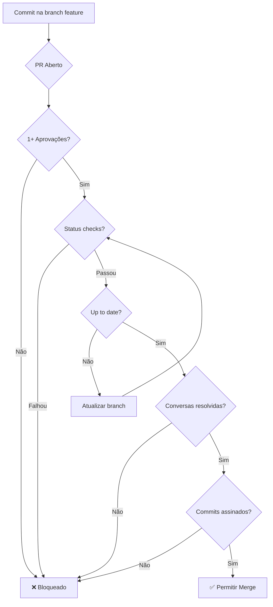

# Configuração do Repositório

Este documento fornece instruções passo a passo para configurar o repositório GitHub seguindo as melhores práticas de colaboração e segurança.

## 📋 Índice

1. [Configurações Gerais](#configurações-gerais)
2. [Branch Protection](#branch-protection)
3. [Rulesets](#rulesets)
4. [Configurações de Merge](#configurações-de-merge)
5. [GitHub Actions](#github-actions)
6. [CODEOWNERS](#codeowners)
7. [Dependabot](#dependabot)
8. [Automação de Releases](#automação-de-releases)
9. [Checklist Final](#checklist-final)

## Configurações Gerais

### Acesso ao Repositório

1. Navegue para **Settings** no repositório
2. Em **General** → **Access**:
   - ✅ **Visibility**: Private (repositório interno)
   - ✅ **Features**: Habilitar Issues, Projects, Wiki (conforme necessário)

### Configurações de Repositório

**Settings → General → Features**

```yaml
Wikis: ❌ Desabilitado (usar docs/ no repo)
Issues: ✅ Habilitado
Projects: ✅ Habilitado
Discussions: ⚠️ Opcional (recomendado para projetos maiores)
```

**Settings → General → Pull Requests**

```yaml
Allow merge commits: ❌ Desabilitado
Allow squash merging: ✅ Habilitado (PADRÃO)
Allow rebase merging: ❌ Desabilitado
Always suggest updating pull request branches: ✅ Habilitado
Allow auto-merge: ✅ Habilitado
Automatically delete head branches: ✅ Habilitado
```

## Branch Protection

### Configuração para `main`

**Settings → Branches → Branch protection rules → Add rule**

#### Pattern

```
main
```

#### Regras de Proteção

**Protect matching branches:**

```yaml
✅ Require a pull request before merging
   ✅ Require approvals: 1
   ✅ Dismiss stale pull request approvals when new commits are pushed
   ✅ Require review from Code Owners
   ⚠️ Restrict who can dismiss pull request reviews (opcional)
   ❌ Allow specified actors to bypass required pull requests (não usar)

✅ Require status checks to pass before merging
   ✅ Require branches to be up to date before merging
   Status checks required:
      - test
      - lint
      - markdownlint
      - codeql

✅ Require conversation resolution before merging

✅ Require signed commits (recomendado)

✅ Require linear history

✅ Require deployments to succeed before merging (se aplicável)

❌ Lock branch (não usar)

❌ Do not allow bypassing the above settings
   ⚠️ Except: (admins também devem seguir regras)

✅ Restrict who can push to matching branches
   Allowed: (vazio - ninguém pode push direto)

✅ Allow force pushes
   ❌ Everyone (desabilitado)

✅ Allow deletions
   ❌ Desabilitado
```

### Resumo Visual



## Rulesets

Rulesets oferecem controle mais granular que branch protection.

### Settings → Rules → Rulesets → New ruleset

#### Ruleset 1: Naming Convention

**Nome:** `branch-naming-convention`

```yaml
Enforcement: Active
Target branches: All branches

Rules:
  ✅ Restrict creations
     Patterns:
       ✅ Allow: feature/*
       ✅ Allow: fix/*
       ✅ Allow: docs/*
       ✅ Allow: refactor/*
       ✅ Allow: test/*
       ✅ Allow: chore/*
       ✅ Allow: perf/*
       ❌ Deny: * (tudo que não corresponder aos padrões acima)
```

#### Ruleset 2: Commit Message Convention

**Nome:** `commit-message-convention`

```yaml
Enforcement: Active
Target branches: main

Rules:
  ✅ Require commit message to match pattern
     Pattern: ^(feat|fix|docs|style|refactor|perf|test|build|ci|chore|revert)(\(.+\))?: .{1,72}
     Operator: Matches regex
```

#### Ruleset 3: File Restrictions

**Nome:** `critical-file-protection`

```yaml
Enforcement: Active
Target branches: main

Rules:
  ✅ Restrict file paths
     Restricted paths:
       - .github/workflows/*
         Allowed bypasses: @sabesp/tech-leads
       - docs/SECURITY.md
         Allowed bypasses: @sabesp/arquitetura
       - .github/CODEOWNERS
         Allowed bypasses: @sabesp/arquitetura
```

## Configurações de Merge

### Settings → General → Pull Requests

**Merge button:**

```yaml
✅ Allow squash merging
   Default commit message:
      ✅ Pull request title and description
   
   Default message format:
      [x] Pull request title
      [ ] Commit messages
      
❌ Allow merge commits

❌ Allow rebase merging
```

**After merging:**

```yaml
✅ Automatically delete head branches
```

## GitHub Actions

### Settings → Actions → General

**Actions permissions:**

```yaml
⚪ Allow all actions and reusable workflows

⚪ Allow sabesp actions and reusable workflows
   ✅ Allow actions created by GitHub

⚪ Allow select actions and reusable workflows
   Allowed actions:
      - actions/*
      - google-github-actions/*
      - github/*
```

**Workflow permissions:**

```yaml
⚪ Read and write permissions

⚪ Read repository contents permission
   ✅ Allow GitHub Actions to create and approve pull requests
```

**Fork pull request workflows:**

```yaml
⚪ Run workflows from fork pull requests
   ❌ Desabilitado (repositório interno)
```

### Secrets e Variables

**Settings → Secrets and variables → Actions**

#### Secrets

```yaml
# Azure credentials (se necessário)
AZURE_CREDENTIALS
AZURE_SUBSCRIPTION_ID
AZURE_TENANT_ID
AZURE_CLIENT_ID

# Outros secrets conforme necessário
```

#### Variables

```yaml
AZURE_RESOURCE_GROUP
AZURE_STORAGE_ACCOUNT
PYTHON_VERSION: "3.10"
```

## CODEOWNERS

### Criar `.github/CODEOWNERS`

Este arquivo já foi criado. Verifique se os times existem no GitHub:

**Settings → Access → Collaborators and teams**

Adicione os seguintes times:
- `@sabesp/arquitetura`
- `@sabesp/tech-leads`
- `@sabesp/dados`
- `@sabesp/ia`

**Nota:** Se os times não existirem, crie-os em **Organization Settings → Teams**

### Validação

Teste se CODEOWNERS está funcionando:
1. Abra um PR que modifique um arquivo
2. Verifique se os revisores corretos são automaticamente solicitados
3. Verifique se "Require review from Code Owners" está bloqueando o merge

## Dependabot

### Arquivo Criado

O arquivo `.github/dependabot.yml` já foi criado.

### Habilitar Dependabot

**Settings → Security → Code security and analysis**

```yaml
✅ Dependency graph
   Enabled

✅ Dependabot alerts
   Enabled

✅ Dependabot security updates
   Enabled
```

### Configurar Notifications

**Settings → Notifications**

```yaml
Dependabot alerts:
   ✅ Email notifications
   ✅ Web notifications
   
Severity threshold:
   ⚪ All severities
   ⚪ High or critical
```

### Auto-merge (Opcional)

Para auto-merge de PRs de dependências de baixo risco:

```bash
# Instalar GitHub CLI
gh extension install gh-cli-for-education/gh-dependabot

# Auto-approve e merge de patch updates
gh dependabot auto-merge --enable
```

## Automação de Releases

### Release Please Configuration

Os arquivos já foram criados:
- `.github/release-please-config.json`
- `.github/.release-please-manifest.json`
- `.github/workflows/release-please.yml`

### Configurar Branch Protection

Certifique-se de que o workflow de release-please tem permissões:

**Settings → Actions → General → Workflow permissions:**

```yaml
⚪ Read repository contents permission
✅ Allow GitHub Actions to create and approve pull requests
```

### Permissões do GITHUB_TOKEN

No workflow `release-please.yml`, verifique:

```yaml
permissions:
  contents: write
  pull-requests: write
```

### Testar Release Please

1. Faça um commit seguindo Conventional Commits na main:
   ```bash
   git commit -m "feat: adiciona nova funcionalidade"
   ```

2. O workflow criará/atualizará um PR de release automaticamente

3. Ao fazer merge do PR de release, uma nova versão será publicada

## Configurações de Security

### Settings → Security → Code security and analysis

```yaml
✅ Dependency graph
   Enabled

✅ Dependabot alerts
   Enabled

✅ Dependabot security updates
   Enabled

✅ Code scanning
   ✅ CodeQL analysis
      Setup workflow: Create or use existing

✅ Secret scanning
   Enabled
   ✅ Push protection (bloqueia commits com secrets)
```

### Security Policy

Verifique que `docs/SECURITY.md` está acessível em:

**Security → Policy** (deve aparecer automaticamente)

## Labels

### Settings → Issues → Labels

Crie os seguintes labels padrão:

| Label | Cor | Descrição |
|-------|-----|-----------|
| `type: bug` | `#d73a4a` | Correção de bug |
| `type: feature` | `#0e8a16` | Nova funcionalidade |
| `type: docs` | `#0075ca` | Melhorias em documentação |
| `type: refactor` | `#fbca04` | Refatoração de código |
| `priority: critical` | `#b60205` | Prioridade crítica |
| `priority: high` | `#d93f0b` | Prioridade alta |
| `priority: medium` | `#fbca04` | Prioridade média |
| `priority: low` | `#0e8a16` | Prioridade baixa |
| `status: blocked` | `#000000` | Bloqueado |
| `status: in-progress` | `#c2e0c6` | Em progresso |
| `status: ready-for-review` | `#0e8a16` | Pronto para revisão |
| `team: arquitetura` | `#5319e7` | Time de Arquitetura |
| `team: dados` | `#1d76db` | Time de Dados |
| `team: ia` | `#d4c5f9` | Time de IA |
| `dependencies` | `#0366d6` | Atualizações de dependências |
| `security` | `#ee0701` | Relacionado a segurança |

### Automatizar Labels (Opcional)

Crie `.github/labeler.yml` para auto-labeling:

```yaml
'type: docs':
  - docs/**/*
  - '*.md'

'type: ci':
  - .github/**/*

'team: dados':
  - pipelines/**/*
  - src/ingestion/**/*
  - src/transform/**/*

'team: ia':
  - src/ml/**/*
  - notebooks/**/*
```

## Templates

### Issue Templates

Crie `.github/ISSUE_TEMPLATE/`:

**bug_report.md:**
```yaml
---
name: Bug Report
about: Reportar um bug
title: '[BUG] '
labels: 'type: bug'
assignees: ''
---

## Descrição
<!-- Descrição clara e concisa do bug -->

## Passos para Reproduzir
1. 
2. 
3. 

## Comportamento Esperado
<!-- O que deveria acontecer -->

## Comportamento Atual
<!-- O que está acontecendo -->

## Ambiente
- Versão: 
- Python: 
- OS: 

## Logs
```

**feature_request.md:**
```yaml
---
name: Feature Request
about: Sugerir uma nova funcionalidade
title: '[FEATURE] '
labels: 'type: feature'
assignees: ''
---

## Descrição
<!-- Descrição clara da funcionalidade -->

## Motivação
<!-- Por que essa funcionalidade é necessária? -->

## Solução Proposta
<!-- Como você imagina que isso deveria funcionar? -->

## Alternativas Consideradas
<!-- Outras soluções que você considerou -->

## Contexto Adicional
<!-- Qualquer outra informação relevante -->
```

## Checklist Final

### Configurações Básicas

- [ ] Repositório configurado como Private
- [ ] Issues habilitadas
- [ ] Wiki desabilitada (usando docs/)
- [ ] Squash merge como única opção
- [ ] Auto-delete de branches habilitado

### Branch Protection

- [ ] Branch `main` protegida
- [ ] Require 1 aprovação mínima
- [ ] Require status checks (test, lint, markdownlint)
- [ ] Require conversation resolution
- [ ] Require signed commits (recomendado)
- [ ] Require linear history
- [ ] Block force push
- [ ] Block delete

### Rulesets

- [ ] Ruleset de naming convention criado
- [ ] Ruleset de commit message convention criado
- [ ] Ruleset de file restrictions criado (opcional)

### CODEOWNERS

- [ ] Arquivo `.github/CODEOWNERS` criado
- [ ] Times (@sabesp/arquitetura, etc.) existem no GitHub
- [ ] "Require review from Code Owners" habilitado

### Dependabot

- [ ] Arquivo `.github/dependabot.yml` criado
- [ ] Dependabot alerts habilitado
- [ ] Dependabot security updates habilitado
- [ ] Notifications configuradas

### GitHub Actions

- [ ] Workflow permissions configuradas
- [ ] Secrets necessários adicionados
- [ ] Variables configuradas

### Security

- [ ] Code scanning (CodeQL) habilitado
- [ ] Secret scanning habilitado
- [ ] Push protection habilitado
- [ ] Security policy (`docs/SECURITY.md`) visível

### Release Automation

- [ ] Release Please config criado
- [ ] Release Please manifest criado
- [ ] Workflow de release-please criado
- [ ] Permissões para criar PRs habilitadas

### Documentation

- [ ] Todos os arquivos de docs/ criados
- [ ] README.md atualizado com links
- [ ] Templates de PR criados
- [ ] Templates de issues criados (opcional)
- [ ] Labels criados

### Testing

- [ ] Tentar criar branch com nome inválido (deve falhar)
- [ ] Tentar push direto na main (deve falhar)
- [ ] Abrir PR e verificar CODEOWNERS (revisores corretos)
- [ ] Abrir PR e verificar CI executa
- [ ] Fazer commit convencional e verificar release PR é criado
- [ ] Verificar Dependabot cria PRs para atualizações

## Comandos de Verificação

### Verificar Branch Protection

```bash
gh api repos/:owner/:repo/branches/main/protection | jq
```

### Verificar CODEOWNERS

```bash
gh api repos/:owner/:repo/codeowners/errors
```

### Verificar Workflows

```bash
gh workflow list
gh workflow view release-please.yml
```

### Verificar Dependabot

```bash
gh api repos/:owner/:repo/vulnerability-alerts
```

## Troubleshooting

### CODEOWNERS não funciona

1. Verifique se os times existem no GitHub
2. Verifique se você é membro dos times
3. Verifique sintaxe do arquivo CODEOWNERS
4. Verifique se "Require review from Code Owners" está habilitado

### Release Please não cria PRs

1. Verifique permissões do workflow
2. Verifique se commits seguem Conventional Commits
3. Verifique logs do workflow
4. Verifique se há release PR aberto já

### Dependabot não cria PRs

1. Verifique se Dependabot está habilitado
2. Verifique sintaxe do `dependabot.yml`
3. Verifique schedule (pode demorar até a próxima execução)
4. Verifique se há limites de PRs abertos

### CI não executa

1. Verifique permissões de Actions
2. Verifique sintaxe dos workflows
3. Verifique se workflows estão na branch correta
4. Verifique logs de execução

## Manutenção

### Revisão Trimestral

- [ ] Revisar e atualizar CODEOWNERS
- [ ] Revisar labels e usage
- [ ] Revisar branch protection rules
- [ ] Revisar dependências desatualizadas
- [ ] Revisar documentação

### Auditoria de Segurança

- [ ] Revisar secret scanning alerts
- [ ] Revisar Dependabot alerts
- [ ] Revisar CodeQL alerts
- [ ] Revisar acessos e permissões

## Recursos Adicionais

- [GitHub Docs - Branch Protection](https://docs.github.com/en/repositories/configuring-branches-and-merges-in-your-repository/managing-protected-branches)
- [GitHub Docs - CODEOWNERS](https://docs.github.com/en/repositories/managing-your-repositorys-settings-and-features/customizing-your-repository/about-code-owners)
- [GitHub Docs - Dependabot](https://docs.github.com/en/code-security/dependabot)
- [Release Please Documentation](https://github.com/googleapis/release-please)

---

**Última atualização:** 2026-02-12  
**Próxima revisão:** 2026-05-12  
**Responsável:** Time de Arquitetura
