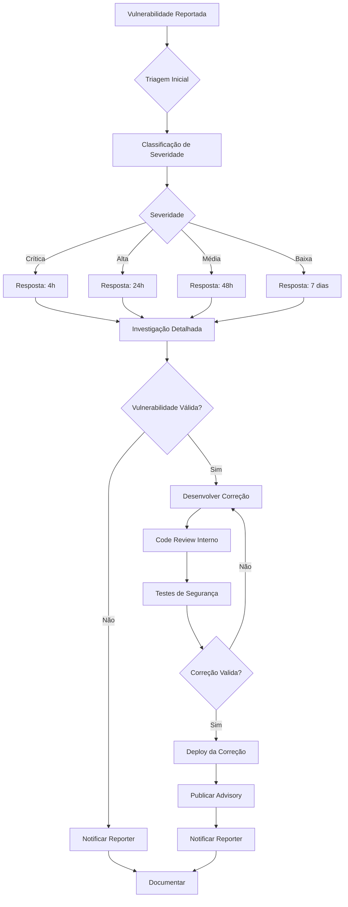
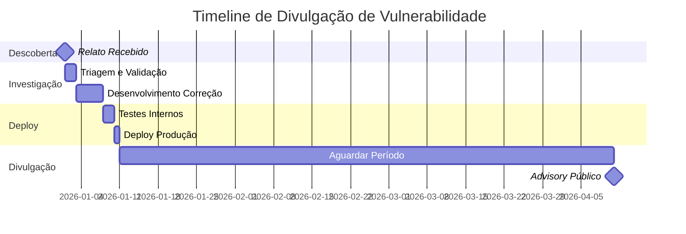

# Política de Segurança

## Versões Suportadas

As seguintes versões do projeto recebem atualizações de segurança:

| Versão | Suportada          | Fim do Suporte |
|--------|--------------------|----------------|
| 0.x.x  | :white_check_mark: | Em desenvolvimento |
| < 0.1  | :x:                | N/A |

**Nota:** Como o projeto está em desenvolvimento ativo (versão 0.x.x), todas as correções de segurança são aplicadas apenas à versão mais recente na branch `main`.

## Como Reportar uma Vulnerabilidade

### 🔒 Relato Privado de Vulnerabilidades

**NÃO** crie issues públicas para vulnerabilidades de segurança. Em vez disso:

1. **Envie um e-mail para:** seguranca@sabesp.com.br
2. **Assunto:** `[SECURITY] Vulnerabilidade em app_data_ingestion_pipelines`
3. **Inclua:**
   - Descrição detalhada da vulnerabilidade
   - Passos para reproduzir
   - Impacto potencial
   - Sugestões de correção (se houver)
   - Seu nome/contato para follow-up

### Exemplo de Relato

```
Assunto: [SECURITY] Vulnerabilidade em app_data_ingestion_pipelines

Descrição:
Descobri uma potencial injeção de código no módulo de validação
de arquivos JSON que pode permitir execução arbitrária de código.

Passos para Reproduzir:
1. Criar arquivo JSON malicioso com payload específico
2. Submeter via endpoint de ingestão
3. Código é executado durante validação

Impacto:
- Severidade: Alta
- Confidencialidade: Alta
- Integridade: Alta
- Disponibilidade: Média

Ambiente Afetado:
- Versão: 0.2.0
- Módulo: src/validation/json_validator.py

Sugestão de Correção:
Utilizar validação estrita de schema com biblioteca
pydantic ao invés de eval() direto.

Contato:
Nome: João Silva
E-mail: joao.silva@empresa.com
```

## Processo de Resposta

### Fluxo de Tratamento



### SLA de Resposta

| Severidade | Tempo de Resposta Inicial | Tempo de Correção | Comunicação |
|------------|---------------------------|-------------------|-------------|
| 🔴 **Crítica** | 4 horas | 24 horas | Imediata + Advisory público após correção |
| 🟠 **Alta** | 24 horas | 7 dias | Within 48h + Advisory após correção |
| 🟡 **Média** | 48 horas | 30 dias | Within 7 dias + Incluído em release notes |
| 🟢 **Baixa** | 7 dias | 90 dias | Incluído em release notes |

### Classificação de Severidade

#### 🔴 Crítica

- Execução remota de código (RCE)
- Acesso não autorizado a dados sensíveis de clientes
- Escalação de privilégios para admin
- Bypass completo de autenticação

**Exemplos:**
- SQL Injection permitindo dump de dados
- Deserialização insegura permitindo RCE
- Credenciais hardcoded com acesso a produção

#### 🟠 Alta

- Acesso não autorizado a dados internos
- Bypass parcial de autenticação
- Injection que permite modificação de dados
- Denial of Service (DoS) crítico

**Exemplos:**
- XSS permitindo roubo de sessões
- Path traversal expondo arquivos do sistema
- CSRF em operações críticas

#### 🟡 Média

- Information disclosure limitado
- DoS não crítico
- Bypass de controles menores
- Vulnerabilidades que requerem interação do usuário

**Exemplos:**
- Exposição de informações de versão
- Rate limiting ausente
- Validação de input fraca

#### 🟢 Baixa

- Problemas de configuração
- Vulnerabilidades teóricas
- Issues que requerem pré-condições improváveis

**Exemplos:**
- Headers de segurança ausentes
- Informações em logs
- Deprecated dependencies sem exploit conhecido

## Boas Práticas para Contribuidores

### Código Seguro

#### ✅ Faça

```python
# Validação de entrada com Pydantic
from pydantic import BaseModel, validator

class UserInput(BaseModel):
    telefone: str
    
    @validator('telefone')
    def validate_telefone(cls, v):
        if not v.isdigit():
            raise ValueError('Telefone deve conter apenas dígitos')
        return v

# Uso de prepared statements
query = "SELECT * FROM calls WHERE id = ?"
cursor.execute(query, (call_id,))

# Sanitização de paths
from pathlib import Path
safe_path = Path(base_dir) / Path(user_input).name
```

#### ❌ Não Faça

```python
# Execução direta de código
eval(user_input)  # NUNCA!
exec(user_input)  # NUNCA!

# SQL Injection
query = f"SELECT * FROM calls WHERE id = {user_id}"  # Vulnerável!

# Path Traversal
file_path = f"/data/{user_input}"  # Vulnerável!
```

### Secrets Management

#### ✅ Boas Práticas

- Use Azure Key Vault para credenciais
- Nunca commite secrets no código
- Use variáveis de ambiente
- Rotacione credenciais regularmente
- Use managed identities quando possível

```python
# Correto: Usando Azure Key Vault
from azure.keyvault.secrets import SecretClient
from azure.identity import DefaultAzureCredential

credential = DefaultAzureCredential()
client = SecretClient(vault_url="https://myvault.vault.azure.net/", credential=credential)
secret = client.get_secret("database-password")
```

#### ❌ Nunca Faça

```python
# ERRADO: Hardcoded secrets
PASSWORD = "super_secret_123"  # NUNCA!
API_KEY = "abcd1234efgh5678"  # NUNCA!

# ERRADO: Secrets em configs commitadas
config = {
    "db_password": "senha123"  # NUNCA!
}
```

### Dependências

- Mantenha dependências atualizadas
- Revise dependências antes de adicionar
- Use Dependabot para atualizações automáticas
- Verifique vulnerabilidades conhecidas (CVEs)

```bash
# Verificar vulnerabilidades em dependências Python
pip-audit

# Verificar dependências desatualizadas
pip list --outdated
```

## Ferramentas de Segurança

### Automáticas (CI/CD)

| Ferramenta | Propósito | Frequência |
|------------|-----------|------------|
| **Dependabot** | Atualização de dependências | Semanal |
| **CodeQL** | Análise estática de código | Cada PR |
| **pip-audit** | Scan de vulnerabilidades Python | Cada PR |
| **Bandit** | Security linter Python | Cada PR |

### Manuais (Recomendadas)

| Ferramenta | Propósito | Quando Usar |
|------------|-----------|-------------|
| **OWASP ZAP** | Teste de penetração web | Antes de releases maiores |
| **Azure Defender** | Proteção de cloud | Contínuo |
| **git-secrets** | Prevenção de commit de secrets | Setup local |

## Programa de Recompensas

Atualmente, **não** temos um programa formal de bug bounty. No entanto:

- ✅ Reconhecimento público (se desejado)
- ✅ Crédito no SECURITY.md e release notes
- ✅ Certificado digital de agradecimento

## Divulgação Responsável

Seguimos os princípios de **Divulgação Coordenada de Vulnerabilidades**:

1. **Reporter** notifica a equipe de segurança
2. **Equipe** confirma e desenvolve correção
3. **Correção** é aplicada em produção
4. **Advisory** público é publicado (90 dias após correção ou acordo mútuo)
5. **Crédito** é dado ao reporter (se autorizado)

### Timeline Típico



## Hall da Fama de Segurança

Agradecemos às seguintes pessoas por reportar vulnerabilidades de forma responsável:

<!-- Esta seção será atualizada conforme vulnerabilidades são reportadas e corrigidas -->

*Nenhum relato ainda. Seja o primeiro!*

## Recursos Adicionais

### Documentação

- [OWASP Top 10](https://owasp.org/www-project-top-ten/)
- [Azure Security Best Practices](https://docs.microsoft.com/azure/security/)
- [Python Security Guide](https://python.readthedocs.io/en/latest/library/security_warnings.html)

### Treinamentos Internos

- Security Awareness (obrigatório anual)
- Secure Coding Python (recomendado)
- Azure Security Fundamentals (para DevOps)

### Contatos

| Tipo | Contato | Resposta |
|------|---------|----------|
| **Vulnerabilidades** | seguranca@sabesp.com.br | Conforme SLA |
| **Dúvidas Gerais** | arquitetura@sabesp.com.br | 48h |
| **Emergências** | +55 11 XXXX-XXXX (plantão) | Imediato |

## Compliance

Este projeto deve estar em conformidade com:

- ✅ LGPD (Lei Geral de Proteção de Dados)
- ✅ ISO 27001 (Segurança da Informação)
- ✅ Políticas internas de segurança da Sabesp
- ✅ Regulamentações do setor de saneamento

## Revisão desta Política

Esta política é revisada:

- 📅 Semestralmente (Janeiro e Julho)
- 🔄 Após incidentes de segurança significativos
- 📋 Quando há mudanças em regulamentações

---

**Última revisão:** 2026-02-12  
**Próxima revisão:** 2026-07-12  
**Responsável:** Time de Arquitetura
