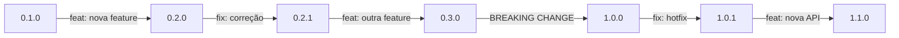
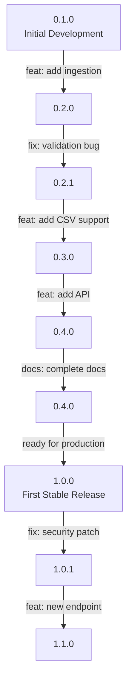
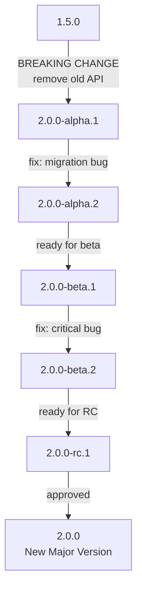
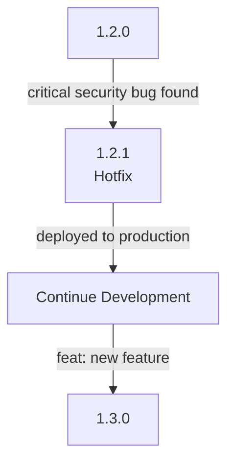
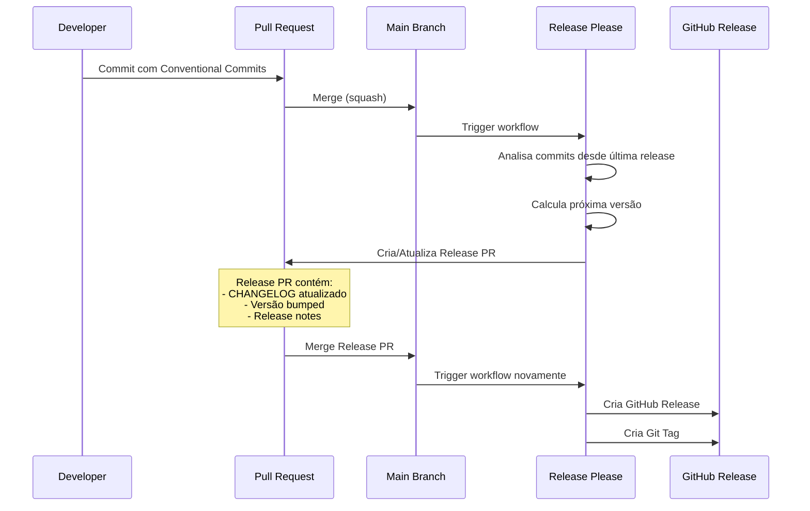

# Versionamento Semântico

## Visão Geral

Este projeto segue o [Versionamento Semântico 2.0.0](https://semver.org/lang/pt-BR/) (Semantic Versioning). Um número de versão no formato **MAJOR.MINOR.PATCH** comunica claramente o tipo de mudanças incluídas.

```
MAJOR.MINOR.PATCH
  │     │     │
  │     │     └─── Correções de bugs (backward compatible)
  │     └───────── Novas funcionalidades (backward compatible)
  └─────────────── Mudanças incompatíveis (breaking changes)
```

## Formato da Versão

### Estrutura

```
<MAJOR>.<MINOR>.<PATCH>[-<PRE-RELEASE>][+<BUILD>]
```

**Exemplos:**
- `1.0.0` - Release estável
- `0.1.0` - Desenvolvimento inicial
- `1.2.3` - Release estável com patches
- `2.0.0-alpha.1` - Pré-release alpha
- `1.0.0+20240212` - Com metadata de build

### Componentes

#### MAJOR (Versão Principal)

Incrementa quando você faz mudanças **incompatíveis** na API.

**Quando incrementar:**
- ❌ Remove funcionalidades públicas
- ❌ Muda assinaturas de funções públicas
- ❌ Muda comportamento esperado de forma incompatível
- ❌ Remove suporte a versões de dependências

**Exemplos:**
```
1.5.0 → 2.0.0  (breaking change)
```

**Exceção:** Versão `0.x.y` é considerada desenvolvimento inicial. Pode ter breaking changes a qualquer momento.

#### MINOR (Versão Secundária)

Incrementa quando você adiciona funcionalidade **compatível com versões anteriores**.

**Quando incrementar:**
- ✅ Adiciona nova funcionalidade pública
- ✅ Deprecia funcionalidade (mas mantém funcionando)
- ✅ Melhoria substancial em funcionalidade interna
- ✅ Adiciona novos endpoints/métodos

**Exemplos:**
```
1.2.0 → 1.3.0  (nova funcionalidade)
```

**Nota:** PATCH é resetado para 0 quando MINOR incrementa.

#### PATCH (Correção)

Incrementa quando você faz **correções de bugs** compatíveis com versões anteriores.

**Quando incrementar:**
- 🐛 Corrige bug que não muda a API
- 🔧 Melhoria de performance
- 📝 Atualização de documentação (opcional)
- 🔐 Correção de segurança sem breaking changes

**Exemplos:**
```
1.2.0 → 1.2.1  (correção de bug)
```

## Mapeamento com Conventional Commits

| Tipo de Commit | Incrementa | Exemplo |
|----------------|------------|---------|
| `feat:` | MINOR | 0.1.0 → 0.2.0 |
| `fix:` | PATCH | 0.1.0 → 0.1.1 |
| `perf:` | PATCH | 0.1.0 → 0.1.1 |
| `BREAKING CHANGE:` | MAJOR | 0.9.0 → 1.0.0 |
| `docs:`, `style:`, `refactor:`, `test:`, `build:`, `ci:`, `chore:` | Nenhum* | - |

*Dependendo da configuração, alguns podem incrementar PATCH.

### Exemplos de Fluxo



## Regras de Incremento

### 1. Versão Inicial

```
0.1.0
```

- Primeira versão de desenvolvimento
- Qualquer mudança pode quebrar compatibilidade
- Usado até a primeira release estável

### 2. Primeira Release Estável

```
0.x.y → 1.0.0
```

Quando o projeto está pronto para produção:
- API pública definida
- Documentação completa
- Testes abrangentes
- Estável para uso

### 3. Incremento de PATCH

```
1.0.0 → 1.0.1
```

**Deve:**
- Corrigir bugs
- Ser backward compatible
- Não adicionar funcionalidades

**Pode:**
- Melhorar performance
- Corrigir documentação
- Atualizar dependências (sem breaking changes)

### 4. Incremento de MINOR

```
1.0.1 → 1.1.0
```

**Deve:**
- Adicionar nova funcionalidade
- Ser backward compatible
- Resetar PATCH para 0

**Pode:**
- Depreciar funcionalidades (mas manter funcionando)
- Fazer melhorias substanciais internas

### 5. Incremento de MAJOR

```
1.9.0 → 2.0.0
```

**Deve:**
- Incluir breaking changes
- Resetar MINOR e PATCH para 0
- Documentar migração

**Pode:**
- Incluir novas funcionalidades
- Incluir correções de bugs

## Pré-Releases

Versões de pré-release são indicadas por um sufixo após PATCH.

### Formato

```
<MAJOR>.<MINOR>.<PATCH>-<IDENTIFICADOR>.<NÚMERO>
```

### Identificadores Comuns

#### alpha (α)

Primeira fase de testes. Pode estar incompleta e instável.

```
1.0.0-alpha.1
1.0.0-alpha.2
...
```

**Características:**
- 🔴 Muito instável
- ⚠️ Funcionalidades incompletas
- 🧪 Apenas para testes internos

#### beta (β)

Segunda fase. Funcionalidades completas, mas pode ter bugs.

```
1.0.0-beta.1
1.0.0-beta.2
...
```

**Características:**
- 🟡 Relativamente estável
- ✅ Funcionalidades completas
- 🧪 Testes com usuários selecionados

#### rc (Release Candidate)

Candidata a release. Potencialmente final a menos que bugs críticos sejam encontrados.

```
1.0.0-rc.1
1.0.0-rc.2
...
```

**Características:**
- 🟢 Estável
- ✅ Pronta para produção
- 🔍 Últimos testes antes da release

### Ordenação de Pré-Releases

```
1.0.0-alpha.1
  < 1.0.0-alpha.2
  < 1.0.0-beta.1
  < 1.0.0-beta.2
  < 1.0.0-rc.1
  < 1.0.0-rc.2
  < 1.0.0
```

## Metadata de Build

Informações adicionais que não afetam precedência de versão.

### Formato

```
<VERSÃO>+<METADATA>
```

### Exemplos

```
1.0.0+20260213
1.0.0+sha.5114f85
1.0.0+20260213.sha.5114f85
```

**Uso:**
- Data/hora do build
- Commit SHA
- Build number do CI
- Informações de pipeline

## Exemplos de Evolução

### Cenário 1: Desenvolvimento até Produção



### Cenário 2: Breaking Change



### Cenário 3: Hotfix



## Automação com Release Please

### Como Funciona



### Configuração

Veja `.github/release-please-config.json`:

```json
{
  "release-type": "python",
  "packages": {
    ".": {
      "changelog-sections": [
        {"type": "feat", "section": "Features"},
        {"type": "fix", "section": "Bug Fixes"},
        {"type": "perf", "section": "Performance Improvements"},
        {"type": "docs", "section": "Documentation", "hidden": false}
      ]
    }
  }
}
```

### Processo Manual vs Automático

#### ❌ Processo Manual (Antigo)

```bash
# Atualizar manualmente versão em arquivos
# Escrever CHANGELOG manualmente
# Criar tag manualmente
git tag v1.0.0
git push origin v1.0.0
# Criar release no GitHub manualmente
```

#### ✅ Processo Automático (Release Please)

```bash
# Apenas fazer commit seguindo Conventional Commits
git commit -m "feat: adiciona nova funcionalidade"
git push

# Release Please faz o resto automaticamente!
```

## Dependências e Compatibilidade

### Especificação de Dependências

Use ranges compatíveis com SemVer em `requirements.txt` ou `pyproject.toml`:

```toml
# Exato
pydantic = "2.5.0"

# Patch updates permitidos
pydantic = "~2.5.0"  # >=2.5.0, <2.6.0

# Minor updates permitidos
pydantic = "^2.5.0"  # >=2.5.0, <3.0.0

# Qualquer versão compatível
pydantic = ">=2.5.0"
```

### Recomendações

| Tipo de Dependência | Operador | Razão |
|---------------------|----------|-------|
| Bibliotecas estáveis | `^` (caret) | Aceita novos features, não breaking changes |
| Bibliotecas críticas | `~` (tilde) | Apenas bug fixes |
| Ferramentas de build | `>=` | Geralmente seguro usar versão mais recente |
| Versão 0.x | `~` ou exato | Versões 0.x podem quebrar a qualquer momento |

## Política de Suporte

### Versões Suportadas

| Versão | Suporte | Fim de Vida |
|--------|---------|-------------|
| 1.x.x | ✅ Completo | Até 2.0.0 + 6 meses |
| 0.x.x | ⚠️ Best effort | Até 1.0.0 |
| < 0.1.0 | ❌ Não suportado | N/A |

### SLA de Correções

| Tipo | Versão MAJOR Atual | Versão MAJOR Anterior |
|------|--------------------|-----------------------|
| 🔴 Crítico | < 24h | < 48h |
| 🟠 Alto | < 7 dias | Best effort |
| 🟡 Médio | Próximo MINOR | Não |
| 🟢 Baixo | Backlog | Não |

## Checklist de Release

### Antes de Incrementar MAJOR

- [ ] Documentar breaking changes
- [ ] Criar guia de migração
- [ ] Atualizar exemplos
- [ ] Notificar usuários com antecedência
- [ ] Considerar período de depreciação

### Antes de Incrementar MINOR

- [ ] Adicionar testes para nova funcionalidade
- [ ] Atualizar documentação
- [ ] Adicionar exemplos de uso
- [ ] Verificar backward compatibility

### Antes de Incrementar PATCH

- [ ] Adicionar teste que reproduz o bug
- [ ] Verificar que fix não quebra nada
- [ ] Atualizar documentação se necessário

## Recursos

### Documentação Oficial

- [Semantic Versioning 2.0.0](https://semver.org/lang/pt-BR/)
- [Conventional Commits](CONVENTIONAL_COMMITS.md)
- [Release Please](https://github.com/googleapis/release-please)

### Ferramentas

| Ferramenta | Propósito |
|------------|-----------|
| `release-please` | Automação de releases |
| `bump2version` | Bump manual de versão |
| `poetry version` | Gestão de versão com Poetry |
| `semantic-release` | Alternativa ao release-please |

## Perguntas Frequentes

### Quando lançar 1.0.0?

Quando seu projeto está:
- ✅ Estável e pronto para produção
- ✅ Com API pública bem definida
- ✅ Documentado completamente
- ✅ Com testes abrangentes
- ✅ Em uso real (ou pronto para)

### Como lidar com versão 0.x?

Versão `0.x.y` é para desenvolvimento inicial:
- MINOR pode incluir breaking changes
- Não há garantia de estabilidade
- Migre para 1.0.0 quando estável

### E se eu esquecer de incrementar?

Release Please faz isso automaticamente baseado nos commits!

### Como fazer hotfix urgente?

```bash
# Branch de hotfix
git checkout -b fix/security-patch

# Commit
git commit -m "fix: corrige vulnerabilidade crítica"

# PR e merge
# Release Please incrementa PATCH automaticamente
```

### Posso pular versões?

Não pule versões. Siga a sequência:
- ❌ 1.0.0 → 1.2.0 (pulou 1.1.0)
- ✅ 1.0.0 → 1.1.0 → 1.2.0

---

**Última atualização:** 2026-02-12  
**Versão:** 1.0.0  
**Baseado em:** Semantic Versioning 2.0.0
